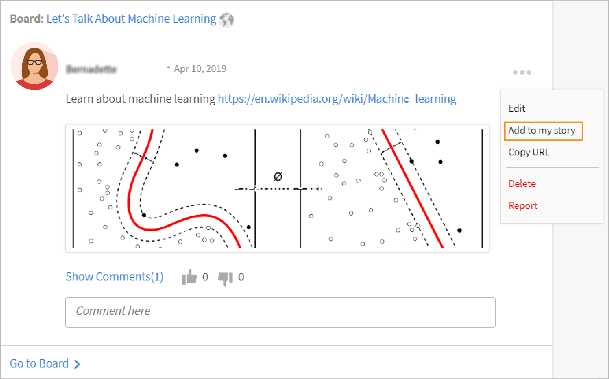

# Adobe Learning Manager 中的社交学习

了解学习者如何使用“社交学习”网页

社交学习是 Adobe Learning Manager 中一个让用户在轻松随意环境下分享其想法和见解的平台。该学习方法是对传统学习理念的一种有益补充，因为学完在线课程并不一定能为用户在社交层面增加与同行进行互动交流的能力优势。

仅仅参加一次培训，并不能保证用户能够学到所教的全部内容。另一方面，社交学习则能让用户充分利用周边专业知识来获得其实际所需的信息，用户反过来可以快速应用这些信息来完成一项任务或实现一个目标。

同样，Learning Manager的“社交学习”功能允许用户通过共享内容和从中学习来相互互动。

此平台上可以分享的内容包括视频、音频、屏幕截图、文本、问题和投票。用户还可以使用&#x200B;**分享到社交小册子**，与同事分享其在线学习。 有关更多信息，请参阅[分享至社交学习](share-to-social.md)。

还可借助&#x200B;**Adobe Learning Manager桌面应用程序**&#x200B;将内容发布到讨论区。 有关详细信息，请参阅[Adobe Learning Manager桌面应用程序](../adobe-learning-manager-app-for-desktop.md)。

仅当管理员启用社交学习后，学习者才能看到该功能。

 

*查看学习信息板*

<table>
 <tbody>
  <tr>
   <td>
    
<b>序号数字</b>
</td>
   <td>
    
<b>术语或概念</b>
</td>
   <td>
    
<b>简要说明</b>
</td>
  </tr>
  <tr>
   <td>
    
1
</td>
   <td>
    
我的讨论区
</td>
   <td>
    
讨论区是由用户创建的<code>
      collection
     </code>个帖子。 参与或关注过的所有帖子。
</td>
  </tr>
  <tr>
   <td>
    
2
</td>
   <td>
    
所有讨论区
</td>
   <td>
    
在“所有讨论区”页面中，用户可以查看共享活动范围内所有学习者创建的讨论区。
</td>
  </tr>
  <tr>
   <td>
    
3
</td>
   <td>
    
评论
</td>
   <td>
    
用户可以评论和查看讨论区中的帖子。 
</td>
  </tr>
  <tr>
   <td>
    
4
</td>
   <td>
    
回复
</td>
   <td>
    
用户可以回复讨论区中帖子的评论。
</td>
  </tr>
  <tr>
   <td>
    
5
</td>
   <td>
    
点赞/拍砖
</td>
   <td>
    
单击点赞和拍砖按钮以表达自己喜欢或不喜欢某个帖子。
</td>
  </tr>
  <tr>
   <td>
    
6
</td>
   <td>
    
社交排行榜
</td>
   <td>
    
在社交排行榜中，用户可以查看学习者的姓名及其参与社交学习所获得的点数。
</td>
  </tr>
  <tr>
   <td>
    
7
</td>
   <td>
    
我的关注
</td>
   <td>
    
用户可在此处查看自己所关注的其他学习者的姓名及其创建的帖子数。
</td>
  </tr>
  <tr>
   <td>
    
8
</td>
   <td>
    
常用技能
</td>
   <td>
    
在“所有讨论区”部分，学习者们可以查看自己经常使用的技能以及使用该技能创建的帖子数量。
</td>
  </tr>
  <tr>
   <td>
    
9
</td>
   <td>
    
分享至社交
</td>
   <td>
    
“分享至社交”是一个书签工具，允许用户将自己的在线学习内容（如网页和博客）直接分享至 Adobe Learning Manager 社交学习平台。
</td>
  </tr>
  <tr>
   <td>
    
10
</td>
   <td>
    
新帖子
</td>
   <td>
    
“新帖子”按钮允许用户创建内容并发布到讨论区中。
</td>
  </tr>
 </tbody>
</table>

## 创建内容帖子 {#creatingcontentasapost}

内容可以创建成讨论区的帖子。要创建帖子，请执行以下步骤：

1. 单击&#x200B;**[!UICONTROL 新建帖子]。**

   
   *选择新帖子*

1. 选择要发布的内容类型：文本、问题、视频、音频、投票和屏幕截图。现有内容可以从用户系统或 Adobe Learning Manager 桌面应用程序的图库上传。

   使用 Adobe Learning Manager 桌面应用程序录制视频或屏幕、音频或截取屏幕截图。有关详细信息，请参阅[Adobe Learning Manager桌面应用程序](../adobe-learning-manager-app-for-desktop.md)。

   <!---->

1. 搜索与帖子相关的讨论区或技能。如果讨论区不存在，请单击&#x200B;**[!UICONTROL 创建新讨论区]**。

   

   *创建讨论区*

   如果您是外部或内部用户，并且管理员授予您创建讨论区的权限，则可以创建讨论区。如果您无权创建讨论区，则不会显示&#x200B;**创建新讨论区**&#x200B;链接。

1. 在弹出的对话框中，填写详细信息，选择以下讨论区类型：

   * **公共** — 所有用户均可参与帖子和查看帖子。
   * **私密** — 帖子仅对添加到讨论区的讨论区创建者、版主和用户可见。
   * **受限** — 只有讨论区所有者、管理员和讨论区版主可以创建帖子。 其他用户可以通过评论/回复、上投票/下投票等方式进行参与。

   <!---->

   >[!NOTE]
   >
   >在Social Learner应用中，只有&#x200B;**管理员**&#x200B;能够创建包含用户组（内部/外部）的私人讨论区。
   >
   >除管理员外，作者、学习者、经理以及讲师等其他任何用户 **无法**&#x200B;创建包含用户组的私人讨论区。 在创建私人讨论区时，他们无法看到&#x200B;**用户组**&#x200B;的节。

   仅限管理员：选择&#x200B;**“私人”**&#x200B;后，您会看到两个选项，即&#x200B;**“用户”**&#x200B;和&#x200B;**“用户组”**。选择&#x200B;**“用户组”**&#x200B;选项，然后添加要与其共享私人讨论区的用户组。

   “用户组”字段可选择内部、外部或自定义组。 如此一来，您的私人讨论区将对所有指定用户组可见，与范围设置无关。

1. 要共享内容，请单击&#x200B;**[!UICONTROL 发布]**。 单击“发布”后，用户会收到通知。

   内容会根据[讨论区版主/主题专家](social-learning-web-user.md#HowtobecomeaSubjectMatterExpertSME)策划的管理员为社交学习内容设置的监管设置发布。

   <!---->

1. 用户在其帖子被批准或拒绝后会收到相应通知（前提是管理员将监管设置为“仅手动监管”）。如果帖子被拒绝，单击&#x200B;**点击查看**&#x200B;超链接即可查看讨论区版主或行业专家 (SME) 的审核意见。

   用户创建的内容由讨论区版主或行业专家负责监管。

   <!---->

在“社交学习”中创建或回复帖子时，可以使用富文本编辑器撰写帖子并应用不同类型的格式。

*使用富文本编辑器创建帖子*

此外，在创建讨论区时，您可以在富文本编辑器中访问同一组选项。

*使用富文本编辑器创建帖子*

## 查看批准的内容 {#viewingapprovedcontent}

帖子获得批准后，即会显示在社交学习讨论区中。用户现在可以对帖子进行评论、回复、点赞/拍砖。

用户可以使用以下内容类型进行评论：录制屏幕、网络摄像头或两者、录制音频、截取屏幕截图、上传文件、Adobe Learning Manager 图库。

<!---->

## 社交播放器中的内容 {#contentinsocialplayer}

在 Adobe Learning Manager 中，视频、静态内容（如演示文稿和图像）会发布在讨论区的社交播放器中。您可以从系统上传文件、录制视频/屏幕，或借助 Adobe Learning Manager 桌面应用程序截取屏幕截图。

用户完成内容发布后，其活动范围内的其他学习者即可查看这些内容。学习者可在社交播放器中查看、评论/回复、点赞/拍砖或举报不当内容。

<!---->

**要在社交播放器中进行评论/回复、点赞/拍砖，请执行以下步骤：**

1. 单击社交播放器右下角的全屏按钮。
1. 要查看屏幕上的播放器控件，单击向下箭头。
1. 要查看评论部分，单击屏幕左下角的评论图标。
1. 用户可以评论/回复，点赞/拍砖或举报不当内容。
1. 单击 Esc 键可退出全屏模式。

## 社交学习平台中的讨论区视图 {#board-view-social}

学习者可以在列表视图中查看所有讨论区。 登录您的学习者应用程序，在“社交学习”页面中单击相应按钮，如下所示：

*社交学习平台中的讨论区视图*

以讨论区格式查看帖子时，您随后可按照&#x200B;**帖子**&#x200B;和&#x200B;**投稿人**&#x200B;对帖子进行排序。

* 如果选择&#x200B;**帖子**，系统将根据讨论区中的帖子数对讨论区进行排序。
* 如果选择&#x200B;**参与者**，系统将根据对话中已评论或答复的用户数对讨论区进行排序。

### 技能过滤器 {#skillfilter}

*对帖子进行排序*

使用“技能”过滤器，您可以选择多个技能来过滤讨论区。 选择技能后，您还可以清除过滤器。

### 活动等级过滤器 {#activitylevelfilter}

*筛选活动级别*

使用“活动”过滤器，您可以根据讨论区中交互的数量对讨论区进行排序。 您可以按照以下方式进行排序：

* 高强度活动
* 正常活动
* 低强度活动

在讨论区视图中，您可以执行常规讨论区级操作。

<!---->

## 下载帖子 {#downloadposts}

学习者可以从社交学习平台下载包含附件的内容，以便离线使用此内容。

*下载社交学习中的帖子*

您可以从“帖子”、“评论”或“回复”部分下载内容。 一次只能下载一个文件。

这两种类型的用户（内部或外部）都必须能够下载内容。

在帖子、评论或回复的搜索结果中也可以看到“下载”按钮。

您仍无法在设备应用程序中下载帖子。 此功能将很快推出。

## 支持的内容格式 {#supportedcontentformats}

<table>
 <tbody>
  <tr>
   <td>
    
<b>内容类型</b>
</td>
   <td>
    
<b>扩展名</b>
</td>
  </tr>
  <tr>
   <td>
    
视频
</td>
   <td>
    
wmv、f4v、asf、3gp、3g2、avi、mov、h264、m4v、mp4、MPEG、mpg
</td>
  </tr>
  <tr>
   <td>
    
音频
</td>
   <td>
    
mp3、am、m4a、wav、wma、aac
</td>
  </tr>
  <tr>
   <td>
    
静态文件
</td>
   <td>
    
PDF、ppt、pptx、doc、docx、xls、xlsx
</td>
  </tr>
  <tr>
   <td>
    
图像
</td>
   <td>
    
jpg、jpeg、png、bmp、gif
</td>
  </tr>
 </tbody>
</table>

## 讨论区仅对选定用户可见 {#selected-users}

拥有&#x200B;**管理员**&#x200B;角色的学习者可将用户组添加到私人讨论区。 任何用户组均可添加到私人讨论区，并且属于该用户组的用户只有此讨论区的访问权限。

如果将新用户添加到用户组，则两个用户都可以看到私人讨论区。

如果从私人讨论区删除了任何用户，则该用户将无法再看到此私人讨论区。

如果将多个用户组添加到私人讨论区，则这两个组的所有用户都可以访问私人讨论区。

<!---->

## 可对帖子进行的操作 {#actionsthatcanbedoneonapost}

单击帖子右上角的折叠菜单图标以查看其选项。将显示以下菜单列表：编辑、添加到我的故事、复制 URL、删除和举报。

仅部分用户有权限执行某些特定任务。以下类型的用户为内容所有者、讨论区版主和公司管理员。

<table>
 <tbody>
  <tr>
   <td>
    
<b>序号数字</b>
</td>
   <td>
    
<b>操作</b>
</td>
   <td>
    
<b>说明</b>
</td>
  </tr>
  <tr>
   <td>
    
1
</td>
   <td>
    
编辑
</td>
   <td>
    
“编辑”允许内容创建者更正或修改其帖子。
</td>
  </tr>
  <tr>
   <td>
    
2
</td>
   <td>
    
添加到我的故事
</td>
   <td>
    
故事是用户所监管内容的合集。用户可将内容的可见性设置为“私人”或“公开”。
</td>
  </tr>
  <tr>
   <td>
    
3
</td>
   <td>
    
复制 URL
</td>
   <td>
    
此选项允许所有用户复制或发布并共享讨论区的 URL。
</td>
  </tr>
  <tr>
   <td>
    
4
</td>
   <td>
    
删除
</td>
   <td>
    
删除选项可在用户确认后删除帖子。
</td>
  </tr>
  <tr>
   <td>
    
5
</td>
   <td>
    
举报
</td>
   <td>
    
任何用户如果发现某个帖子侵犯了个人隐私或含有不当内容，均有权举报。

    
某个帖子被举报后，系统会向讨论区管理员和版主发送通知，以便采取进一步措施。
</td>
  </tr>
 </tbody>
</table>

**添加到我的故事**

社交故事允许用户使用其自己创建或其他用户创建的帖子来添加或创建故事。

要添加帖子到故事，请执行以下步骤：

1. 单击帖子右上角的折叠菜单图标，然后单击&#x200B;**[!UICONTROL 添加到我的故事]**。

   

   *添加到故事*

1. 在&#x200B;**选择故事**&#x200B;对话框，选择要添加到帖子的相关故事。如无相关现成故事，请单击&#x200B;**“新故事”**&#x200B;以创建故事。

   

   *创建故事*

1. 在“新故事”对话框中，填写“故事名称”和“描述”字段。您还可以将故事的可见性设置为“公开”或“私人”。

   

   *添加故事名称和描述*

   要查看用户创建的故事，请从个人资料菜单选项中单击相应的用户名。

## 不同用户对帖子的操作权限 {#userprivilegesforperformingtheactionsonapost}

<table>
 <tbody>
  <tr>
   <td>
    
 
</td>
   <td>
    
<b>内容所有者</b>
</td>
   <td>
    
<b>任何用户</b>
</td>
   <td>
    
<b>讨论区版主</b>
</td>
   <td>
    
<b>管理员</b>
</td>
  </tr>
  <tr>
   <td>
    
<b>编辑</b>
</td>
   <td>
    
是
</td>
   <td>
    
否
</td>
   <td>
    
否
</td>
   <td>
    
否
</td>
  </tr>
  <tr>
   <td>
    
<b>添加到我的故事</b>
</td>
   <td>
    
是
</td>
   <td>
    
是
</td>
   <td>
    
是
</td>
   <td>
    
是
</td>
  </tr>
  <tr>
   <td>
    
<b>复制 URL</b>
</td>
   <td>
    
是
</td>
   <td>
    
是
</td>
   <td>
    
是
</td>
   <td>
    
是
</td>
  </tr>
  <tr>
   <td>
    
<b>删除</b>
</td>
   <td>
    
是
</td>
   <td>
    
否
</td>
   <td>
    
是
</td>
   <td>
    
是
</td>
  </tr>
  <tr>
   <td>
    
<b>报告</b>
</td>
   <td>
    
是
</td>
   <td>
    
是
</td>
   <td>
    
是
</td>
   <td>
    
是
</td>
  </tr>
 </tbody>
</table>

## 在讨论区查看内容 {#viewingcontentinboards}

讨论区是帖子的合集。社交学习中的每个讨论区均是基于技能而创建。在社交学习中，用户可以查看&#x200B;**所有讨论区**&#x200B;页面和&#x200B;**我的讨论区**&#x200B;页面。

“所有讨论区”页面显示活动范围内的所有用户所创建的帖子或讨论区。但“我的讨论区”页面仅显示用户自己所创建、关注和参与的讨论区。

在“我的讨论区”页面中，可以根据以下内容筛选可见的讨论区：**全部**、**由我创建**、**由我注释**、**后跟我**。

*筛选可见讨论区*

在“我的讨论区”和“所有讨论区”中，用户均可按&#x200B;**相关性**&#x200B;或&#x200B;**日期**&#x200B;来对讨论区进行排序。

*按相关性和日期对讨论区进行排序*

创建帖子时，如果帖子没有关联的讨论区，请单击[创建新讨论区](social-learning-web-user.md#Creatingcontentasapost)。  要查看、编辑、删除、报告、复制URL以及将讨论区添加到您喜爱的讨论区列表，请执行以下步骤：

1. 单击讨论区名称或单击&#x200B;**[!UICONTROL 转到讨论区]**。
1. 在讨论区页面，单击折叠菜单图标并从下拉列表中选择一个选项。

   <!---->

**用户可以在讨论区页面上查看以下选项：**

* 此页面会显示帖子数、查看次数和此讨论区的关注人数。除此之外，还会显示讨论区创建者姓名和创建日期，以及讨论区中排名靠前的行业专家。

* 用户的讨论区收藏列表中已添加的讨论区名称也会显示在此页面中。

<!---->

## 分享至社交 {#sharetosocial}

“分享至社交”是一个书签工具，允许用户将自己的在线学习内容（如网页和博客）作为帖子直接分享至社交页面。有关更多信息，请参阅[分享至社交学习](share-to-social.md)。

*分享到社交学习*

## 我的技能 {#myskills}

用户可以在“我的讨论区”页面中查看自己的技能和使用这些技能创建的帖子数或讨论区数。要查看用户在创建讨论区时使用的所有技能，请单击&#x200B;**[!UICONTROL “查看所有技能”]**。

*查看所有技能*

## 我的关注 {#peopleifollow}

用户可在“我的讨论区”页面中查看自己的关注对象姓名和自己创建的帖子数。

*学习者关注的人*

要关注其他用户，请执行以下步骤：

1. 要查看其他用户的个人资料页面，请单击其姓名。
1. 单击关注/取消关注按钮以执行相关操作。

   

   *关注或取消关注用户*

## 社交排行榜 {#socialleaderboard}

社交排行榜强化了社交学习的游戏化风格。用户在社交学习中创建新的帖子/讨论区、发布的帖子被点赞、提供了问题的正确答案以及参与其他活动时均会获得相应的活动点数。

社交排行榜列表会显示同一范围内所有用户的总点数和新帖子数。获得点数最高的学习者会显示在社交排行榜列表顶部，其后次之，以此类推。

在&#x200B;**我的讨论区**&#x200B;页面单击&#x200B;**[!UICONTROL 前往排行榜]**，查看所有学习者及他们获得的点数。

*查看所有学习者*

## 活动点数 {#activitypoints}

用户所获得的活动点数基于其所进行的社交活动。

**用户可以通过以下方式获得活动点：**

* 创建一个讨论区 - 5 点。
* 添加一个帖子（文本或问题类型）- 5 点。
* 评论任何帖子 - 2 点。
* 讨论区的首个用户可获得 1 点。用户在该讨论区的前 20 个新帖子中共可获得 20 点。

## 如何成为行业专家 (SME) {#howtobecomeasubjectmatterexpertsme}

行业专家 (SME) 是指在某项技能方面具有特定专业知识的人士。在Learning Manager Social Learning中，系统会根据授予用户某项技能的最大活动点数将用户指定为行业专家。

排名靠前的行业专家有权监管学习者的内容，然后将其发布在社交学习的讨论区中。

公司管理员有权增加学习者的点数，使其成为某项技能的行业专家。

## 行业专家如何监管内容？ {#howtocuratecontentasasme}

1. 用户在创建新帖子或讨论区后，行业专家会收到通知，显示讨论区中有帖子等待监管。

   <!---->

1. 若要审核帖子，请单击&#x200B;**单击以审阅**&#x200B;链接。 此操作会将行业专家导航至内容审阅页面，如下图所示。

   <!---->

1. 如需根据与该讨论区技能的相关性（百分比）对内容进行评级，请选择相关性标尺中的颜色。第一种颜色为不相关（相关性 10%），最后一种颜色为高度相关（相关性 100%）。
1. 建议行业专家根据既定的相关性分数输入一条评论。用户在阅读评论后能够更好地了解其帖子被拒绝的原因。

<!--## AI-enabled auto curation {#autocuration}-->

## 在正式和非正式学习中搜索 {#searchinformalandinformallearning}

社交学习中的每个页面都有搜索字段，用户可查找任何讨论区、技能或内容。在搜索字段中输入相关信息并单击搜索图标或按键盘上的 Enter 键即可进行搜索。

<!---->

以下页面在非正式学习中具有搜索字段：**我的讨论区**、**所有讨论区**、**讨论区页面**、用户的&#x200B;**个人资料页面**&#x200B;和&#x200B;**其他学习者的个人资料页面**。

用户在非正式学习中搜索内容时，屏幕会显示 Adobe Learning Manager 非正式和正式学习中搜索到的内容结果总数。

同样，在正式学习页面中搜索内容时，也会显示在非正式学习中搜索到的结果数。

*学习的搜索结果*

在非正式学习讨论区页面，仅可搜索讨论区相关的内容，与讨论区无关的内容则不会显示。

## 查看用户个人资料 {#viewuserprofile}

如果对某位学习者启用了社交学习，则该用户即可单击社交学习右上角的头像并从下拉列表中单击其姓名来查看其个人资料。

*查看用户个人资料*

在个人资料页面，学习者可以查看获得的总点数、创建的帖子数以及自己的关注者数量。

学习者还可以查看自己被指定为行业专家的相关技能。

学习者的页面还显示学习者的&#x200B;**精选故事**、**最近进行的活动**&#x200B;以及他们关注的&#x200B;**人**。

## 通知 {#notifications}

行业专家批准或拒绝帖子后，用户会收到通知并可单击窗口右上角的通知图标进行查看。用户还可查看社交学习和正式学习活动的通知。

<!---->
