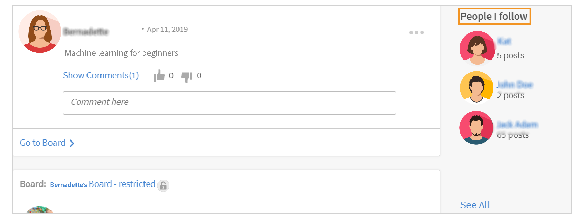

# Learning Manager中的社交学习

了解学习者如何使用“社交学习”网页

社交学习是Learning Manager中的一个平台，可让用户在非正式环境中分享想法和有意义的见解。 它是对传统学习观念的补充。 完成在线课程并不能使用户在社交层面与同龄人进行互动。

仅仅参加培训并不能保证用户能够保留所有教材。 另一方面，社交学习让用户能够利用周围的专业知识获得他们所需要的信息。 反过来，用户可以快速应用这些信息来完成任务，并实现一个目标。

同样，Learning Manager的“社交学习”功能允许用户通过共享内容和从中学习来相互互动。

在此平台上，可以共享的不同类型的内容包括视频、音频、屏幕截图、文本、问题和投票。 用户还可以使用 **共享到社交小册子**. 有关详细信息，请参阅  [分享至社交学习](share-to-social.md).

还可以借助，将内容发布到讨论区 **AdobeLearning Manager桌面应用程序**. 有关详细信息，请参阅  [AdobeLearning Manager桌面应用程序](../adobe-learning-manager-app-for-desktop.md).

仅当管理员启用社交学习时，学习者才能看到该功能。

 

*查看学习信息板*

<table>
 <tbody>
  <tr>
   <td>
    
<b>序号 不行。</b>
</td>
   <td>
    
<b>术语或概念</b>
</td>
   <td>
    
<b>简要说明</b>
</td>
  </tr>
  <tr>
   <td>
    
1
</td>
   <td>
    
我的讨论区
</td>
   <td>
    
讨论区是 <code>
      collection
     </code> 用户创建的帖子的数量。 我的讨论区会显示用户已参与、创建和关注的所有帖子。
</td>
  </tr>
  <tr>
   <td>
    
2
</td>
   <td>
    
所有讨论区
</td>
   <td>
    
在“所有讨论区”页面中，用户可查看由所有共享活动范围的学习者创建的讨论区。
</td>
  </tr>
  <tr>
   <td>
    
3
</td>
   <td>
    
注释
</td>
   <td>
    
用户可以评论和查看在讨论区中创建的帖子。 
</td>
  </tr>
  <tr>
   <td>
    
4
</td>
   <td>
    
回复
</td>
   <td>
    
用户可以回复对讨论区中帖子的评论。
</td>
  </tr>
  <tr>
   <td>
    
5
</td>
   <td>
    
支持票/反对票
</td>
   <td>
    
单击“点赞”和“点赞”按钮来点赞或不点赞帖子。
</td>
  </tr>
  <tr>
   <td>
    
6
</td>
   <td>
    
社交排行榜
</td>
   <td>
    
在社交排行榜中，用户可查看学习者姓名以及他们通过参与社交学习获得的点数。
</td>
  </tr>
  <tr>
   <td>
    
7
</td>
   <td>
    
我关注的人
</td>
   <td>
    
在此处，用户可查看其关注的其他学习者的姓名以及他们创建的帖子数。
</td>
  </tr>
  <tr>
   <td>
    
8
</td>
   <td>
    
热门技能
</td>
   <td>
    
在“所有讨论区”部分，可以查看学习者经常使用的技能以及他们使用该技能创建的帖子数。
</td>
  </tr>
  <tr>
   <td>
    
9
</td>
   <td>
    
分享到社交媒体
</td>
   <td>
    
“分享至社交”是一份小册子，用户可通过该小册子直接将在线学习（如网页和博客）分享至Learning Manager Social Learning。
</td>
  </tr>
  <tr>
   <td>
    
10
</td>
   <td>
    
新建帖子
</td>
   <td>
    
新帖子按钮允许用户在讨论区中创建和发布内容。
</td>
  </tr>
 </tbody>
</table>

## 将内容创建为帖子 {#creatingcontentasapost}

内容在讨论区内创建为帖子。 要创建帖子，请执行以下步骤：

1. 点击 **[!UICONTROL 新建帖子].**

   
   *选择新建帖子*

1. 选择以下要发布的任意类型的内容：文本、问题、视频、音频、投票和屏幕截图。 现有内容可以从用户系统上传，也可以从AdobeLearning Manager桌面应用程序的图库上传。

   使用AdobeLearning Manager桌面应用程序录制视频或屏幕、音频或截取屏幕截图。 有关详细信息，请参阅 [AdobeLearning Manager桌面应用程序](../adobe-learning-manager-app-for-desktop.md).

   <!---->

1. 搜索与帖子相关的讨论区或技能。 如果讨论区不存在，请单击 **[!UICONTROL 创建新讨论区]**.

   

   *创建讨论区*

   如果您是外部或内部用户，并且管理员已授予您创建讨论区的权限，则您可以创建讨论区。 如果您无权创建讨论区，则链接 **创建新讨论区** 不显示。

1. 从弹出对话框中，填写详细信息，选择下列类型的板：

   * **公共**  — 所有用户均可参与帖子和查看帖子。
   * **私密**  — 帖子仅对讨论区创建者、版主和添加到讨论区的用户可见。
   * **受限**  — 只有讨论区所有者、管理员和讨论区版主才能创建帖子。 其他用户可以通过评论/回复、上投票/下投票等方式进行参与。

   <!---->

   >[!NOTE]
   >
   >在社交学习者应用程序中，仅 **管理员** 能够创建包含用户组（内部/外部）的私人讨论区。
   >
   >除管理员外，作者、学习者、经理、讲师等其他任何用户 **不能** 创建包含用户组的私人讨论区。 他们看不到 **用户组** 在创建私人讨论区时。

   仅限管理员 — 当您选择 **私密**，您会看到两个选项： **用户** 和 **用户组**. 选择选项 **用户组**，然后添加要与其共享私人讨论区的用户组。

   在“用户组”字段中，可以选择内部、外部或自定义组。 然后，所有指定的用户组都可以看到您的私人讨论区，无论范围设置如何。

1. 要共享内容，请单击 **[!UICONTROL Post]**. 单击“发布”后，用户会收到通知。

   内容会根据管理员为社交学习内容设置的监管设置发布，可通过以下方式监管  [讨论区版主/主题专家](social-learning-web-user.md#HowtobecomeaSubjectMatterExpertSME).

   <!---->

1. 如果管理员已将监管设置设为仅手动监管，则当用户的帖子被批准或拒绝时，用户会收到通知。 如果帖子被拒绝，请单击 **单击以审阅** 超链接审阅讨论区版主或行业专家(SME)提供的评论。

   用户创建的内容由讨论区版主或主题专家进行精选。

   <!---->

在“社交学习”中创建或回复帖子时，您可以使用富文本编辑器撰写帖子并应用不同类型的格式。

*使用富文本编辑器创建帖子*

此外，在创建讨论区时，您可以在富文本编辑器中访问同一组选项。

*使用富文本编辑器创建帖子*

## 查看批准的内容 {#viewingapprovedcontent}

帖子获得批准后，即会显示在“社交学习”讨论区中。 用户现在可以对帖子进行评论、回复、点赞/拍砖。

用户可使用以下类型的内容添加注释：录制屏幕、网络摄像头或同时使用两者、录制音频、截取屏幕截图、上传文件、Learning Manager图库。

<!---->

## 社交播放器中的内容 {#contentinsocialplayer}

在Learning Manager中，视频、演示文稿和图像等静态内容会发布在讨论区的社交播放器中。 您可以从系统上传文件、录制视频/屏幕，或借助AdobeLearning Manager桌面应用程序截取屏幕截图。

用户发布完某些内容后，其他学习者可以在其活动范围内查看这些内容。 在社交播放器上，学习者可以查看、评论/回复、点赞/拍砖，以及举报滥用。

<!---->

**要在社交播放器中进行评论/回复、点赞/拍砖，请执行以下步骤：**

1. 单击社交播放器右下角的全屏按钮。
1. 要查看屏幕上的播放器控件，请单击向下箭头。
1. 要查看注释部分，请单击屏幕左下角的注释图标。
1. 用户可以评论/回复、点赞/拍砖，以及举报滥用。
1. 单击Esc键退出全屏模式。

## 社交学习平台中的讨论区视图 {#board-view-social}

学习者可以在列表视图中查看所有讨论区。 登录您的学习者应用程序，在“社交学习”页面中单击相应按钮，如下所示：

*社交学习平台中的讨论区视图*

以讨论区格式查看帖子时，您随后可以根据对帖子进行排序 **Post** 和 **投稿人**.

* 如果您选择 **帖子**，将根据讨论区中的帖子数对讨论区进行排序。
* 如果您选择 **贡献者**，将根据对话中已评论或答复的用户数对讨论区进行排序。

### 技能过滤器 {#skillfilter}

*对帖子进行排序*

使用“技能”过滤器，您可以选择多个技能来过滤讨论区。 选择技能后，您还可以清除过滤器。

### 活动级别过滤器 {#activitylevelfilter}

*筛选活动级别*

使用“活动”过滤器，您可以根据讨论区中交互的数量对讨论区进行排序。 您可以按照以下方式进行排序：

* 活动率高
* 正常活动
* 活动率低

在讨论区视图中，您可以执行常规讨论区级操作。

<!---->

## 下载帖子 {#downloadposts}

学习者可以从社交学习平台下载包含附件的内容，以便离线使用此内容。

*下载社交学习平台中的帖子*

您可以从“帖子”、“评论”或“回复”部分下载内容。 一次只能下载一个文件。

这两种类型的用户（内部或外部）都必须能够下载内容。

在帖子、评论或回复的搜索结果中也可以看到“下载”按钮。

您还无法在设备应用程序中下载帖子。 此功能即将可用。

## 支持的内容格式 {#supportedcontentformats}

<table>
 <tbody>
  <tr>
   <td>
    
<b>内容类型</b>
</td>
   <td>
    
<b>扩展名</b>
</td>
  </tr>
  <tr>
   <td>
    
视频
</td>
   <td>
    
wmv、f4v、asf、3gp、3g2、avi、mov、h264、m4v、mp4、MPEG、mpg
</td>
  </tr>
  <tr>
   <td>
    
音频
</td>
   <td>
    
mp3、amr、m4a、wav、wma、aac
</td>
  </tr>
  <tr>
   <td>
    
静态文件
</td>
   <td>
    
PDF， ppt， pptx，文档， docx， xls， xlsx
</td>
  </tr>
  <tr>
   <td>
    
图像
</td>
   <td>
    
jpg， jpeg， png， bmp， gif
</td>
  </tr>
 </tbody>
</table>

## 讨论区仅对选定用户可见 {#selected-users}

如果学习者还拥有 **admin** 角色可以将用户组添加到私人讨论区。 任何用户组都可以添加到私人讨论区，而属于该用户组的用户只能访问该讨论区。

如果将新用户添加到该用户组，则两个用户都可以看到私人讨论区。

如果从私人讨论区中删除任何用户，则该用户将无法再看到私人讨论区。

如果将多个用户组添加到私人讨论区，则这两个组的所有用户都可以访问私人讨论区。

<!---->

## 可以对帖子执行的操作 {#actionsthatcanbedoneonapost}

单击帖子右上角的折叠菜单图标以查看其选项。 显示以下菜单列表：编辑、添加到我的文章、复制URL、删除和报告。

只有部分用户有权执行特定任务。 以下类型的用户是内容所有者、讨论区版主和组织管理员。

<table>
 <tbody>
  <tr>
   <td>
    
<b>序号 不行。</b>
</td>
   <td>
    
<b>动作</b>
</td>
   <td>
    
<b>说明</b>
</td>
  </tr>
  <tr>
   <td>
    
1
</td>
   <td>
    
编辑
</td>
   <td>
    
“编辑”允许内容的创建者更正或修改其帖子。
</td>
  </tr>
  <tr>
   <td>
    
2
</td>
   <td>
    
添加到我的故事
</td>
   <td>
    
文章是由用户编排的一组内容。 用户可以将内容的可见性设置为“私有”或“公共”。
</td>
  </tr>
  <tr>
   <td>
    
3
</td>
   <td>
    
复制URL
</td>
   <td>
    
此选项允许所有用户复制讨论区或帖子的URL并进行共享。
</td>
  </tr>
  <tr>
   <td>
    
4
</td>
   <td>
    
删除
</td>
   <td>
    
删除选项可在用户确认后删除帖子。
</td>
  </tr>
  <tr>
   <td>
    
5
</td>
   <td>
    
举报
</td>
   <td>
    
如果帖子侵犯了用户的隐私或其内容不当，每个用户都可以举报滥用帖子。

    
帖子被报告后，系统会向讨论区管理员和版主发送通知，以便采取进一步操作。
</td>
  </tr>
 </tbody>
</table>

**添加到我的故事**

社交文章允许用户使用自己或其他用户创建的帖子添加或创建文章。

要将帖子添加到文章，请执行以下步骤：

1. 单击帖子右上角的折叠菜单图标，然后单击 **[!UICONTROL 添加到我的故事]**.

   

   *添加到文章*

1. 从 **选择文章** 对话框中，选择相关文章以添加帖子。 如果没有相关的现有文章，请单击以创建文章 **新建故事**.

   

   *创建故事*

1. 在“新建文章”对话框中，填写“文章名称”和“描述”字段。 您还可以将文章的可见性设置为“公共”或“私有”。

   

   *添加文章名称和描述*

   要查看用户创建的故事，请从个人资料菜单选项中单击用户名。

## 对帖子执行操作的用户权限 {#userprivilegesforperformingtheactionsonapost}

<table>
 <tbody>
  <tr>
   <td>
    
 
</td>
   <td>
    
<b>内容所有者</b>
</td>
   <td>
    
<b>任何用户</b>
</td>
   <td>
    
<b>讨论区版主</b>
</td>
   <td>
    
<b>管理员</b>
</td>
  </tr>
  <tr>
   <td>
    
<b>编辑</b>
</td>
   <td>
    
是
</td>
   <td>
    
否
</td>
   <td>
    
否
</td>
   <td>
    
否
</td>
  </tr>
  <tr>
   <td>
    
<b>添加到我的故事</b>
</td>
   <td>
    
是
</td>
   <td>
    
是
</td>
   <td>
    
是
</td>
   <td>
    
是
</td>
  </tr>
  <tr>
   <td>
    
<b>复制URL</b>
</td>
   <td>
    
是
</td>
   <td>
    
是
</td>
   <td>
    
是
</td>
   <td>
    
是
</td>
  </tr>
  <tr>
   <td>
    
<b>删除</b>
</td>
   <td>
    
是
</td>
   <td>
    
否
</td>
   <td>
    
是
</td>
   <td>
    
是
</td>
  </tr>
  <tr>
   <td>
    
<b>举报</b>
</td>
   <td>
    
是
</td>
   <td>
    
是
</td>
   <td>
    
是
</td>
   <td>
    
是
</td>
  </tr>
 </tbody>
</table>

## 查看讨论区内容 {#viewingcontentinboards}

讨论区是帖子集合。 社交学习中的每个讨论区都是根据技能创建的。 在社交学习中，用户可以查看 **所有讨论区** 页面和 **我的讨论区** 页面。

在“所有讨论区”页面中，会显示由活动范围内的所有用户创建的帖子或讨论区。 但是，在“我的讨论区”页面中，只显示用户创建、关注和参与的讨论区。

在“我的讨论区”页面中，可以根据以下内容筛选显示的讨论区： **全部**， **由我创建**， **由我注释**， **跟随我**.

*筛选可见讨论区*

在“我的讨论区”和“所有讨论区”中，用户可以根据对讨论区进行排序 **相关性** 或 **日期**.

*按相关性和日期对讨论区进行排序*

创建帖子时，如果帖子没有关联的讨论区，请单击 [创建新讨论区](social-learning-web-user.md#Creatingcontentasapost).  要查看、编辑、删除、报告、复制URL以及将讨论区添加到您喜爱的讨论区列表，请执行以下步骤：

1. 单击电路板名称或单击 **[!UICONTROL 转到讨论区]**.
1. 在讨论区页面中，单击折叠菜单图标，然后从下拉列表中选择一个选项。

   <!---->

**用户可以在讨论区页面上查看以下选项：**

* 此页面上会显示讨论区之后的帖子、视图和人员数量。 讨论区创建者的姓名和讨论区的创建日期也会与讨论区排名靠前的行业专家一同显示。

* 还会显示添加到用户收藏的讨论区列表中的讨论区名称。

<!---->

## 分享到社交媒体 {#sharetosocial}

“分享至社交”是一个小册子，允许用户将在线学习（例如网页和博客）作为帖子直接分享到社交页面上。 有关详细信息，请参阅 [分享至社交学习](share-to-social.md).

*分享至社交学习*

## 我的技能 {#myskills}

用户可在“我的讨论区”页面中查看某项技能创建的帖子或讨论区的技能和数量。 要在创建讨论区时查看用户使用的所有技能，请单击 **[!UICONTROL 查看所有技能]**.

*查看所有技能*

## 我关注的人 {#peopleifollow}

在“我的讨论区”页面中，用户可以查看他们关注的人的姓名以及他们创建的帖子数。

*学习者关注的人*

要关注其他用户，请执行以下步骤：

1. 要查看其他用户的个人资料页面，请单击其名称。
1. 单击“关注/取消关注”按钮以执行所需的操作。

   

   *关注或取消关注用户*

## 社交排行榜内容 {#socialleaderboard}

社交排行榜增强了游戏功能。 用户可以通过以下方式获得活动点数：创建新帖子/讨论区、为帖子投票、提供正确答案以及参与社交学习。

同一范围内所有用户的点数和新帖子总数在社交排行榜列表中可见。 点数最多的学习者显示在社交排行榜列表的顶部，其后依次为其他学习者。

点击 **[!UICONTROL 转到排行榜]** 在 **我的讨论区** 页面以查看所有学习者及其已获得的点数。

*查看所有学习者*

## 活动点数 {#activitypoints}

向用户提供的活动点数取决于执行的社交活动。

**用户可以通过以下方式获得活动点数：**

* 创建讨论区的5点。
* 将帖子添加为文本或问题类型有5点。
* 评论任何帖子得2分。
* 第一个开始使用讨论区的用户可获得1点。 在该讨论区发布的前20个新帖子中，用户总共获得20点。

## 如何成为主题专家(SME) {#howtobecomeasubjectmatterexpertsme}

行业专家(SME)是具备特定技能专业知识的人。 在Learning Manager Social Learning中，系统会根据授予用户某项技能的最大活动点数将用户指定为行业专家。

排名靠前的行业专家有权监管学习者的内容，然后将其发布在社交学习的讨论区中。

组织的管理员还有权为学习者添加更多点数，使其成为某项技能的行业专家。

## 如何以SME的身份监管内容？ {#howtocuratecontentasasme}

1. 当用户创建新帖子或讨论区时，SME会收到通知，显示讨论区中的帖子正在等待监管。

   <!---->

1. 要审核帖子，请单击 **单击以审阅** 链接。 此操作会将SME导航到内容审核页面，看起来如下面的屏幕截图。

   <!---->

1. 要根据内容与讨论区技能的相关性百分比对内容进行评分，请在相关性等级中选择颜色。 第一种颜色被评为无关紧要（10%相关），而最后一种颜色非常相关（100%相关）。
1. 建议行业专家根据给定的特定相关性得分键入评论。 用户可以更好地了解他们的帖子在阅读评论时被拒绝的原因。

<!--## AI-enabled auto curation {#autocuration}-->

## 在正式和非正式学习中搜索 {#searchinformalandinformallearning}

社交学习中的每个页面都有一个搜索字段，允许用户查找任何讨论区、技能或内容。 在搜索字段中键入内容并进行搜索，然后单击搜索图标或按键盘上的Enter键。

<!---->

非正式学习中的以下页面有一个搜索字段： **我的讨论区**， **所有讨论区**， **讨论区页面**，用户的 **个人资料页面**&#x200B;和 **其他学习者的个人资料页面**.

当用户在非正式学习中搜索内容时，会显示对Learning Manager的非正式和正式学习中内容的搜索结果总数。

同样，在正式学习页面中搜索内容时，也会显示非正式学习中找到的搜索结果数。

*学习的搜索结果*

在非正式学习讨论区的页面中，只能进行讨论区相关搜索。 任何与讨论区无关的搜索都不会显示。

## 查看用户个人资料 {#viewuserprofile}

如果学习者启用了“社交学习”，则用户可以通过单击“社交学习”右上角的个人资料图像，然后从下拉列表中单击自己的姓名来查看其个人资料。

*查看用户个人资料*

在个人资料页面中，学习者可以查看获得的点数总数、创建的帖子数以及拥有的关注者数。

学习者还可以查看被指定为主题专家的技能。

学习者的页面还显示以下内容 **精选文章**， **最近的活动** 执行，且 **关注的人** 被他们干掉了。

## Notifications {#notifications}

当SME批准或拒绝帖子时，用户会收到通知，单击窗口右上角的通知图标即可查看此通知。 用户可以查看“社交学习”和“正式学习”活动通知。

<!---->
