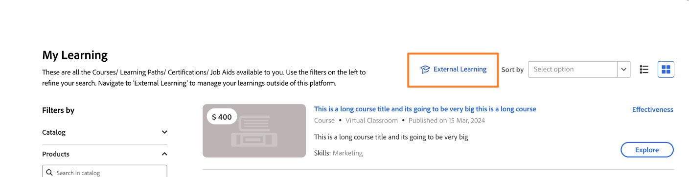

# 以学习者身份提交外部学习

在Adobe Learning Manager中，您可以使用&#x200B;**外部学习**&#x200B;功能记录您在平台之外完成的培训，例如研讨会、认证考试、研讨会或在线课程。 每次提交的内容都会交给经理审核。 批准后，该活动即会显示在“学习者成绩单”中。

## 外部学习提交流程的工作方式

外部学习提交过程分为三个步骤：

1. 填写一份提交表单，其中包含您已完成培训的详细信息，并可选择上传证明。

2. 您的经理会收到平台内通知并审阅您提交的内容。

3. 您的经理批准或拒绝该请求。 您会收到该决定的平台内通知。

批准的提交内容会在您的&#x200B;**学习者成绩单**&#x200B;中显示为已完成的外部学习活动。

您可以根据需要提交任意数量的外部学习请求。 您可以创建的提交数量没有限制。

**在导航中查找外部学习**

外部学习在主导航中的&#x200B;**“我的学习”**&#x200B;中可用。 选择&#x200B;**外部学习**&#x200B;以查看提交历史记录并创建新提交。

<!---->

如果您看不到&#x200B;**“外部学习”**&#x200B;选项，则表明您的管理员可能尚未为您的帐户启用该功能。 请与管理员联系以获取帮助。

### 提交外部学习请求

1. 在左侧导航栏中，选择&#x200B;**我的学习**。

2. 选择&#x200B;**外部学习**&#x200B;选项。

3. 选择&#x200B;**添加外部学习**。
   

4. 填写提交表单：

   1. **标题：**&#x200B;输入培训的名称。 该字段为必填项。

   2. **描述/备注：**&#x200B;添加任何有助于经理了解培训的详细信息，例如提供商姓名或学习目标。

   3. **开始日期：**&#x200B;选择培训开始的日期。

   4. **结束日期：**&#x200B;选择培训完成的日期。

   5. **持续时间：**&#x200B;输入您在培训上花费的总时间（小时）。

   6. **分数：**&#x200B;如果培训包括评估，请输入您的分数。

   7. **附件：**&#x200B;上传证书、转录文本或其他文档作为证据。支持的文件类型包括PDF、DOC、DOCX、PNG、JPEG和JPG。最大文件大小为50 MB。
      

   8. 填写管理员配置的任何其他自定义字段。

5. 选择&#x200B;**提交**。

您的经理会收到应用程序内通知，告知有新的外部学习请求正在等待他们审核。您提交的内容显示在&#x200B;**外部学习**&#x200B;列表中，状态为&#x200B;**正在等待审阅**。
<!---->

>[!NOTE]
>
>经理批准或拒绝您提交的内容时，您会收到平台内通知。

### 编辑待处理的提交

当提交状态为&#x200B;**正在等待批准**&#x200B;时，您可以编辑该提交。 经理批准或拒绝后，您将无法再编辑该提交内容。

1. 在“**外部学习**”选项卡中，找到要更新的提交。

2. 选择提交内容以将其打开。

3. 选择&#x200B;**“编辑”**。

4. 根据需要更新任何字段。 该表单显示了管理员设置的最新字段配置，其中可能包括您最初提交时未显示的字段。

5. 选择&#x200B;**提交**。

您的经理会收到一个新的通知，并审查您更新后的提交内容。

**如果提交被拒绝：**&#x200B;您不能编辑被拒绝的提交。 要重新提交，请创建新的外部学习请求，并参考经理在其评论中提供的任何反馈。

### 外部学习提交状态

| **状态** | **这意味着什么** | **可以编辑吗？** |
|-----------------|----------------------------------------------------------------------------------|---------------------------------------------------------|
| 正在等待审阅 | 您提交的内容正在等待经理审核。 | 是。 从提交详细信息页面中选择&#x200B;**编辑**。 |
| 已批准 | 您的经理批准了提交内容，该内容包含在您的“学习者成绩单”中。 | 数字 |
| 已拒绝 | 您的经理拒绝了提交内容；请查看他们的评论以获得指导。 | 数字 创建新的外部学习请求以重新提交。 |
