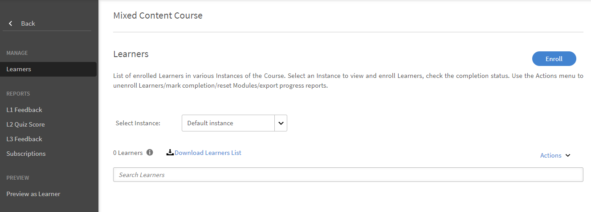
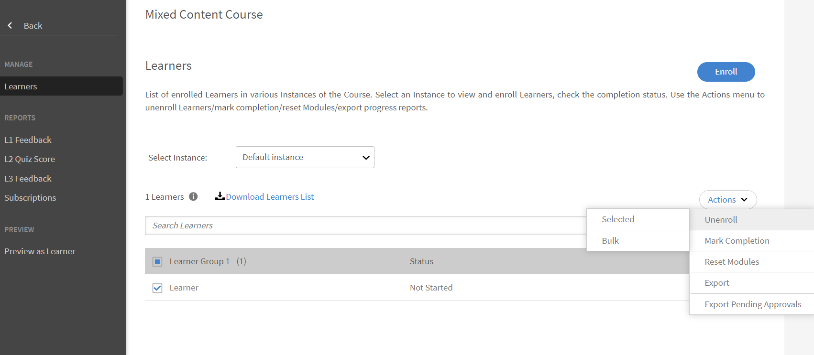

# 学习对象

本文档阐述经理所需了解的学习对象相关信息。

经理可以将课程、学习路径和认证注册到其下方的学习者。 有关注册的更多信息和步骤，请参阅[“注册学员”](../../administrators/feature-summary/courses.md#main-pars_header_1058138132)。

## 课程 {#courses}

## 查看课程 {#viewingcourses}

作为经理，您可以查看所有可用课程的列表。 单击左侧窗格中的&#x200B;**[!UICONTROL 课程]**&#x200B;以查看包含搜索和筛选选项的课程列表。 您还可以在课程缩略图中查看每门课程的课程效果百分比。 请注意，您只能为团队成员注册学员申请中可见的课程。

*查看课程*

>[!NOTE]
>
>单击&#x200B;**已弃用**&#x200B;选项卡可查看所有弃用的课程。

## 查看测验分数 {#viewquizscores}

1. 单击课程缩略图上的课程名称。
1. 单击左侧窗格上的测验分数。

您可以根据用户名或基于每个问题查看任何特定课程的测验分数。 相应地按用户或按问题选择选项卡。 您只能看到团队成员的测验分数。

从下拉列表中选择实例类型，按课程实例查看分数。

## 管理一门课程的学员名单 {#managelearnerslistforacourse}

作为经理，您可以管理团队成员的学员名单。

1. 单击课程缩略图上的课程名称。
1. 在左侧窗格中，单击&#x200B;**[!UICONTROL 学习者]**。

*选择学习者操作*

>[!NOTE]
>
>可以从学习者应用程序中执行&#x200B;**导出待审批**&#x200B;选项。

从“学习者”页面可执行以下操作：

* 选择要删除的学习者，然后单击“操作” > “删除”。
* 选择您想要标记出勤的学习者，然后单击“操作” > “标记完成”。

如允许学习者重置模块并再次继续学习，单击“重置”。 从弹出式对话框中，单击“是”以确认重置。 已完成的模块不能重置。 只有未通过或未完成的模块才能重置。

您也可以将学习者列表导出到 Excel 表格中。 要导出学习者列表，单击“操作” > “导出”。

>[!NOTE]
>
>如果一门课程存在多个实例，则在各标签下单独提供Excel格式的学习者列表。 学习者列表包括学习者姓名、状态和选择条件。 学习者状态可以是&#x200B;**未开始**、**进行中**&#x200B;或&#x200B;**已完成**。

## 查看 L1 和 L3 反馈 {#viewl1andl3feedback}

您可以查看学员就课程提供的 L1 反馈，以及就团队成员提供的 L3 反馈。

1. 单击“课程”列表中的任何课程磁贴。
1. 单击左侧窗格中的 L1 反馈或 L3 反馈，查看收到的反馈。
1. 从下拉列表中选择实例以查看该特定实例的反馈。

## 预览课程 {#previewcourses}

经理可以在查看课程模块时单击&#x200B;**“学习者预览”**&#x200B;选项来预览课程。

1. 登录后，单击左侧窗格中的&#x200B;**[!UICONTROL 课程]**。
1. 单击页面上课程列表中的任何课程磁贴。
1. 单击左窗格中的“学习者预览”，然后单击页面上的模块名称，在播放器预览课程模块。

## 课程效果 {#courseeffectiveness}

通过评估课程效果来了解课程对于学习者是否有帮助。它结合了学习者针对课程内容提出的反馈、学习者的课程测试结果以及经理根据学习者的课程学习情况提供的评估反馈。

您可以在课程缩略图中查看课程效果评分，如下图所示。您可以看到此课程的评级为 100。

<!---->

综合 L1、L2 和 L3 反馈值，得出课程效果评分值。 要查看各个反馈详情，单击课程效果值。 此时会显示弹出窗口，如下所示。

*查看课程效果以获得反馈*

在这个示例截图中，1 名用户（共 1 名）收到了全部三个反馈，因此得分为 100/100。 从这张表格中，您可以发现，如果一门课程缺少三项反馈（L1、L2 和 L3）中的任何一项，就会对总体效果产生负面影响。 单击弹出窗口右下角的向下箭头可查看课程效果的计算方式。

*课程效果计算*

根据上面显示的饼图，经理提供的 L3 反馈的权重更大。

## 搜索课程、学习路径和认证 {#searchingcourseslearningprogramsandcertifications}

Adobe Learning Manager能让您轻松快速找到您想要的课程/学习路径。 您可以通过两种方式搜索课程：

1. 使用“搜索”字段。单击右上角显示的搜索图标。此时会显示搜索字段。输入课程名称或与课程关联的任意关键字来查找课程/学习路径。 您也可以使用预定义的标签(如Captivate、C、Java和HTML)进行搜索。 标签可在搜索字段中进行搜索，也就是说标签会在您输入时显示在搜索字段中。 也可使用唯一的 ID 进行搜索。
1. 使用过滤器过滤课程/学习路径/认证列表。 您可以按状态筛选课程，例如“全部”、“已发布”和“已弃用”。

您可以选择&#x200B;**能力**&#x200B;并进行选择，然后根据能力进行搜索。 经理可以通过四种方式排序课程，以便查找所需课程。 单击“排序方式”并选择字母升序、字母降序、课程更新日期、课程创建日期或课程效果：

* 名称 (a-z)
* 名称 (z-a)
* 日期已更新
* 日期已创建
* 课程效果

*筛选课程*

您可以通过三种方式对学习路径进行排序：字母升序、字母降序和基于更新日期。

*筛选学习路径*

## 为学员注册课程 {#enrollinglearnersintocourses}

经理可以根据企业要求为学员注册必修课程：

1. 将鼠标悬停在任何已发布的课程资料磁贴上，然后单击“注册”学习者。

   或者，单击任何已发布的课程表，然后单击左侧窗格上的学习者。 此时会显示一个页面，列出了学习者名单。 单击“注册”。\
   此时会显示注册学习者对话框。

1. 输入学员姓名或个人资料以选择学员，然后单击“保存”。

>[!NOTE]
>
>您只能注册属于您团队的学习者。

## 学习路径 {#learningprograms}

经理可以注册学员、视图测验得分、L1 和 L3 反馈以及取消注册下属学员。

## 将学习者添加到学习路径 {#addlearnerstoalearningprogram}

1. 在“管理员”模式下，单击左侧窗格中的“学习路径” 。
1. 从磁贴列表中选择已发布的学习路径，向其中添加学习者。
1. 单击左侧窗格中“计划”报告分类中的学员。 注意：必须先发布学习计划，然后才能添加学员。
1. 单击页面中的“注册”链接。
1. 开始输入学习者姓名或个人资料，并从学习者下拉列表中选择“学习者”。 单击“保存”。

## 查看测验分数 {#Viewquizscores-1}

1. 单击任意学习路径磁贴。
1. 单击左侧窗格上的测验分数。

您可以根据用户名或每个问题查看任何特定学习路径的测验分数。 相应地按用户或按问题选择选项卡。 一次显示一门课程的测验分数。 从下拉列表中更改课程名称以查看其他课程的测验分数。 您还可以导出每门课程的测验分数。 从下拉列表中选择实例类型以查看基于学习路径的每个实例的分数。

## 取消注册学习者 {#unenrollmentforlearners}

如果学习者尚未开始学习路径，经理可以取消注册该学习者。

## 标记完成 {#markcompletion}

经理可以将学习者的学习计划标记为完成。 有关更多信息，请参阅[标记完成](../../administrators/feature-summary/learning-paths.md)。

## 认证 {#certifications}

## 为学员注册认证 {#enrolllearnerstothecertification}

您可以通过两种方式为学员注册认证。 请按照以下步骤注册。

1. 以经理身份登录后，单击左侧窗格中的“认证” 。 从“已发布”选项卡列表中，将鼠标悬停于每个认证并单击“注册学习者”。 或者，单击任何已发布的认证磁贴，然后单击左侧窗格中的“学习者” 。 单击学习者页面右侧的“ + Enroll ”以开始添加学习者。
1. 在上述两个步骤中，分别单击“注册学习者”选项后，您可以查看“注册学习者”弹出对话框。 开始输入学习者姓名、个人资料，从下拉列表中选择学习者姓名，然后单击“保存”。

## 取消注册学员 {#Unenrollmentforlearners-1}

经理可以在学员尚未开始认证之前取消注册。

## 标记完成 {#Markcompletion-1}

管理器可以标记认证完成。 有关更多信息，请参阅[标记完成](../../administrators/feature-summary/certifications.md#main-pars_header_303097138)。

## 经理就批准学习者注册课程发出的通知 {#manager-notifications-course-approval}

当尝试接受或拒绝学习者注册课程时，经理现在可以在弹出窗口中查看会话（**视频会议**&#x200B;或&#x200B;**教室**）的详细信息。

*批准或拒绝学习者的注册请求*

将显示以下会话详细信息：

* 会话名称
* 讲师姓名
* 位置
* 日期和时间

工作流程如下：

1. 学习者请求批准课程后，经理会看到通知。

1. 经理单击&#x200B;**会话详细信息**。

   

   *查看待处理的任务*

1. 经理随后批准或拒绝该请求。
1. 如果未按预期进行批准或拒绝，经理会收到确认或错误消息。
1. 学习者会收到有关课程注册的批准或拒绝通知。

## 外部认证的可选提交 {#optional}

在较低版本的 Adobe Learning Manager 中，如要完成外部认证，经理要接受学习者提交的文件。仅当学习者提交文件后，经理才收到通知。

现在，经理可在“外部认证”的“提交内容”页面中看到已注册“外部”认证的学员列表，并且可以在该页面进行“接受”或“拒绝”操作，而无需等待通知。

当经理不等文件提交即接受时，学习者会收到一条显示经理已接受的新消息，并且无需提交文件。如果经理不等文件提交即拒绝，则仍然可以再次选择不等文件即接受。

如果学习者提交文件，则经理可从提交内容页面查看该文件，并根据提交的文件执行“接受”或“拒绝”操作。

*根据文件提交接受或拒绝*

当课程被设为必修时：

* 只有在学习者完成课程后，提交页面才会列出该学习者。
* 学员只有在完成课程之后才能上传文件。

## 工作辅助 {#jobaids}

经理可以管理下属的工作辅助分派。 但是，作为经理，您只能看到已发布的工作辅助，而管理员还可以看到已撤消的工作辅助。
