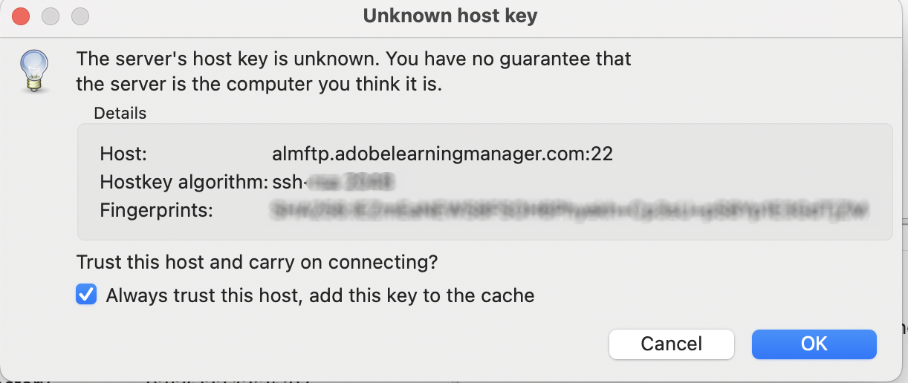

# 从AdobeFTP管理器过渡

AdobeLearning Manager支持使用AWS传输系列的SFTP协议的新连接器。

您可以用AdobeFTP管理器替换任何开源FTP客户端。

列出了AWS推荐的一些FTP客户端 [此处](https://docs.aws.amazon.com/transfer/latest/userguide/transfer-file.html)：

* FileZilla(Windows、macOS和Linux)
* OpenSSH(macOS和Linux) — 注意：此客户端仅适用于启用了安全外壳(SSH)文件传输协议(SFTP)的服务器。
* WinSCP(仅限Microsoft Windows)
* Cyberduck(Windows、macOS和Linux)

## 配置基于AWS的FTP连接器

您必须在集成管理员上配置新的基于AWS的FTP连接器。

*选择“FTP”选项*

连接后，您可以看到“连接详细信息”页面。

*查看连接详细信息页面*

有三个身份验证选项：

### 通过生成新的SSH密钥创建身份验证

如果要在系统本身中生成SSH密钥，可以这样做。 单击“生成SSH密钥”。

私钥将下载到您的计算机，而公钥将保存到我们的服务中。 单击“连接”后，将创建以公钥和私钥作为身份验证的FTP用户。

您已创建FTP连接。

### 使用现有SSH密钥创建身份验证

如果您已有SSH密钥，请将公钥粘贴到 **[!UICONTROL FTP公钥]** 字段，然后单击连接。

*粘贴键*

### 使用密码创建基本身份验证

这是基本的身份验证机制。 选择第一个选项， **[!UICONTROL 使用密码创建基本身份验证]**. 输入密码，然后单击 **[!UICONTROL Connect]**.

这将创建一个连接。

## 后续操作

### 设置FTP客户端

使用下载的密钥或现有的密钥或密码，在FTP客户端上设置连接（在前面一节中推荐）。

### 示例测试导出

* 在FTP客户端中，将ExaVault FTP的位置更改为新的FTP位置。 新域是 `http://almftp.adobelearningmanager.com/`.
* 您还必须将IP列入白名单， `18.195.107.67`.
* 在身份验证之后，必须使用外部FTP客户端或自动脚本上传一些样本文件，以及从新FTP位置下载一些样本文件。
* 您必须将数据从旧位置传输到新位置。
* 连接器的数据保留策略保持不变。 除了官方政策外，ExaVault还支持一些数据保留政策。 新连接器将无法使用此类数据保留策略。 检查您的连接器是否使用了官方支持策略之外的任何数据保留功能。

### 对迁移项目有何影响

| 状态 | 推荐 |
|---|---|
| 新迁移 | 无法从旧FTP启动新迁移。 必须使用新的FTP进行新的迁移。 如需有关此方面的更多支持，请联系客户成功团队。 |
| 正在迁移 | 创建Sprint：您可以继续使用旧版FTP，但我们建议使用新版FTP。 对于任何无法转移的现有Sprint，请联系客户成功团队。 |
| 已关闭的迁移 | 无操作。 |

## 使用Filezilla FTP客户端连接到AdobeLearning Manager

1. 连接到新的ALM FTP连接器。 单击“连接”。

   
   *连接到新的ALM FTP连接器*

1. 要通过密码进行基本身份验证进行连接，请输入域名、FTP用户名，并设置与密码验证条件匹配的密码。 单击“连接”。 将创建新的FTP连接，并且可以通过任何SFTP客户端访问它。

   
   *通过密码进行基本身份验证*

1. 安装任意SFTP客户端，例如File Zilla。 启动“文件Zilla”，然后单击左上角的“打开站点管理器”。

   
   *通过SFTP客户端连接*

1. 点击 **[!UICONTROL 新网站]** 以创建新站点。 根据需要重命名站点。

   
   *创建网站*

1. 从“连接器身份证明”页映射详细资料。

   * 选择“SFTP - SSH文件传输协议”协议
   * 主机为FTP域
   * 将登录类型设置为“请求密码”
   * 用户作为FTP用户名

1. 单击“连接”。

   
   *输入凭据*

   >[!NOTE]
   >
   >在文件Zilla客户端中执行此步骤。

1. 输入密码。

   （可选）选中记住密码复选框以记住密码。

   
   *输入密码*

   （可选）选择 **[!UICONTROL 始终信任此主机]** 复选框，以信任该主机。

1. 单击“确定”。

   
   *主机密钥*

1. 在顶部检查连接的状态和进度。

   左半部分为本地站点，右半部分为远程站点。

   要将文件从本地移动到远程（反之亦然）：

   * 您可以拖放文件。
   * 双击文件。

   
   *检查连接状态*

您可以随时更改和更新身份验证类型。

其他身份验证方法是通过SSH密钥：

将公钥粘贴到文本框以使用现有的SSH密钥。 单击“连接”/“保存”。

要生成新的SSH密钥，请单击“**[!UICONTROL 生成SSH密钥]**&#39;按钮。 将下载私钥。 点击 **[!UICONTROL 连接/保存]**.

*生成SSH密钥*

映射详细信息。 将登录类型选为密钥文件。 选择私钥文件。

点击 **[!UICONTROL Connect]**.

## 弃用ExaVault后会发生什么

弃用ExaVault后，所有正在执行的现有迁移项目都将转换为新的FTP作为源位置。 然后，您必须配置新的FTP连接器并继续迁移过程。

## Recommendations迁移Sprint

在创建迁移项目时，Adobe建议使用新的AWS SFTP连接器创建项目，以避免在后期将Sprint从Exavault迁移到AWS。

如果正在进行迁移，请关闭当前使用Exavault作为数据源的Sprint。 创建AWS SFTP连接、测试设置，然后联系客户成功团队，以切换到新的AWS SFTP数据源。 切换后，在同一迁移项目中创建一个新Sprint 。 此时将在新位置创建Sprint文件夹，您可以上传迁移CSV以继续该活动。

**迁移项目无法关闭的情况**

* 课程ID映射可在当前项目中针对从外部旧版系统迁移到AdobeLearning Manager的课程完成。 您只可以在同一项目中更新相同课程时执行此操作。 关闭项目后，您将无法修改其详细信息。
* 对于基于API的迁移项目，您不得关闭项目。
