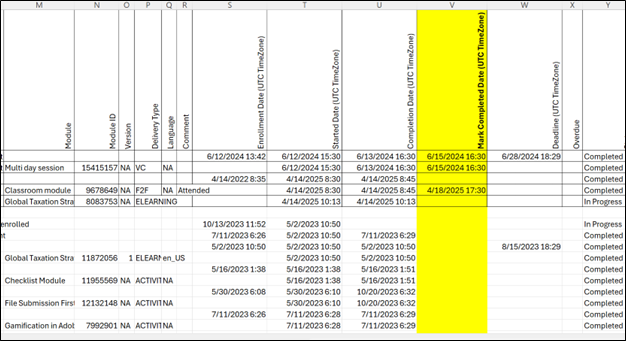

# Adobe Learning Manager中即将推出的更改

我们很高兴与大家分享即将发布的Adobe Learning Manager版本的一些重要更新。 这些增强功能旨在简化管理工作流程、提高数据报告的准确性，以及加强基于角色的控制。

这些更改旨在减少手动操作，支持自动化，并改善整个培训运营的治理。

## 在学习者成绩单中捕捉讲师标记的完成数

### 受众

管理员和自动化所有者

### 概述

在Adobe Learning Manager中，将增量学习者成绩单(LT)用于自动化工作流程时，不会捕获在会话日期之后完成的讲师标记的完成。 完成时间戳反映的是原始会话结束时间（而不是讲师标记完成的时间）。 由于这些更新不在用于增量学习者成绩单生成的一天更改窗口内，因此学习者的出勤和完成数据会从报告中排除，导致下游报告不准确或不完整，并可能存在合规性差距。

### 所做的更改

学习者成绩单(LT)报告包括在会话日期之后由讲师标记的完成情况。 这可确保任何延迟的出勤标记都正确反映在成绩单导出中。

在增量LT导出中，将自动显示“已出席且通过/失败”等出席状态。

### 新增功能

* 新列：标记完成日期（UTC时区）。
* “完成源”在模块级别提供。
* 与基于连接器或作业API生成的学习者成绩单报告兼容。

**需要执行操作**

* 如果自动操作取决于列位置，请确保逻辑考虑新列。
* 如果使用列名，则不需要进行任何更改。
* 不包括翻修完工（手动进口）。

## 下载工作辅助报告中的链接

### 受众

管理员、自定义管理员和自动化所有者

### 概述

工作辅助报告包含每个工作辅助的直接下载链接，允许从报告本身快速访问。

### 新增功能

已将新列&#x200B;**[!UICONTROL 工作辅助链接]**&#x200B;添加到报告中的第三个位置。 如果是文件或显示作者提供的外部URL，则直接链接到工作辅助。

具有访问权限的用户（管理员/作者和自定义角色）可以使用此链接下载工作辅助。

### 需要执行的操作

* 使用工作辅助报告（使用工作API）查看自动化工作流程。
* 如果脚本基于列位置，请相应地更新脚本。
* 如果使用列名，则无需任何操作。

## 已将“内部用户ID”和“经理电子邮件”列添加到“用户报告”

### 受众

使用从管理员用户界面下载的&#x200B;**[!UICONTROL 用户报告]**（**[!UICONTROL 管理员]** > **[!UICONTROL 用户]** > **[!UICONTROL 内部]** > **[!UICONTROL 导出用户数据]**）的管理员（和自定义管理员）。

### 概述

为协助用户识别和集成工作流程，已将&#x200B;**[!UICONTROL 内部用户ID]**&#x200B;和&#x200B;**[!UICONTROL 经理电子邮件]**&#x200B;两列添加到用户报告中，并通过用户界面导出。

### 新增功能

用户报告包括用户的内部用户ID及其经理的电子邮件地址，以在不同工具或API端点之间唯一映射它们。

### 需要执行的操作

* 如果在自动化流程中使用本报告，则应自动处理新添加的列。
* 如果工作流不受影响，则不需要进行任何更改。

## 自定义管理员的限定范围的公告权限

### 受众

自定义管理员

### 概述

自定义管理员只能为其定义范围内的用户组或目录创建公告。

### 新增功能

* 范围规则允许自定义管理员仅为特定用户组或目录创建公告。
* 定义自定义角色时，管理员可以分配通知权限，具体范围取决于用户组或目录。
* 自定义管理员只能在其给定范围内创建公告。
* 自定义管理员的通知公告报告仅显示其指定范围内的学习者。

### 需要执行的操作

* 报告的格式将保持不变。 如果自定义管理员从用户界面下载该报告，则报告的内容将受其范围限制。
* 如果在任何自动化或下游工作流中都没有使用此报告，则无需进行任何修改。

有关Adobe Learning Manager新增功能和所做更改的累积列表，请参阅[发行说明](https://experienceleague.adobe.com/en/docs/learning-manager/using/introduction/release-notes)文章。
