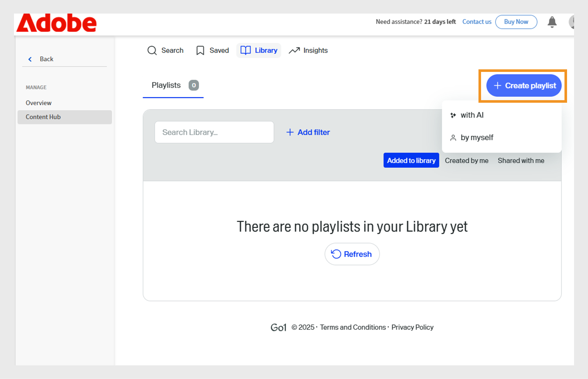
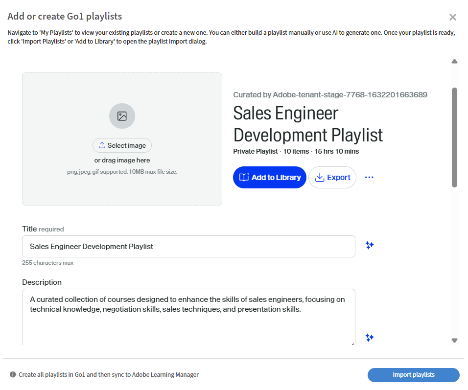
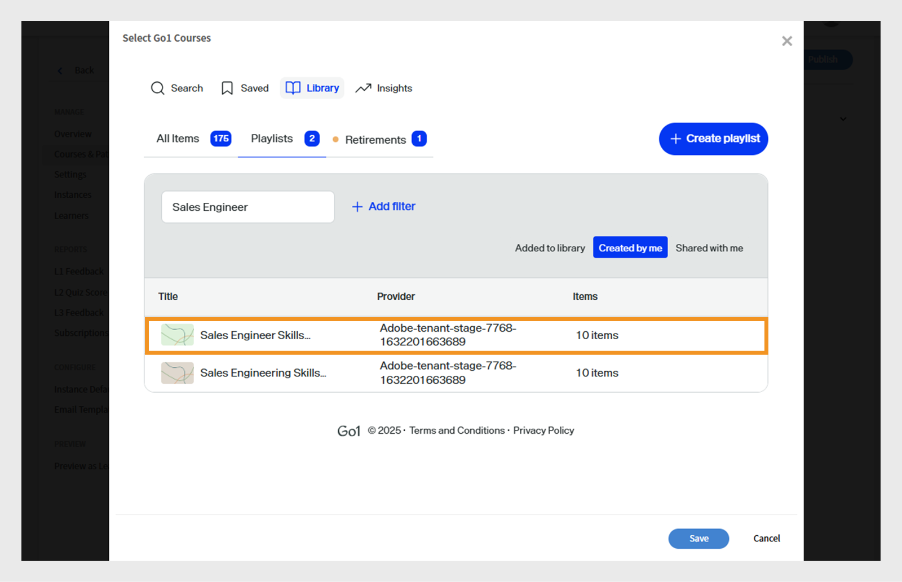
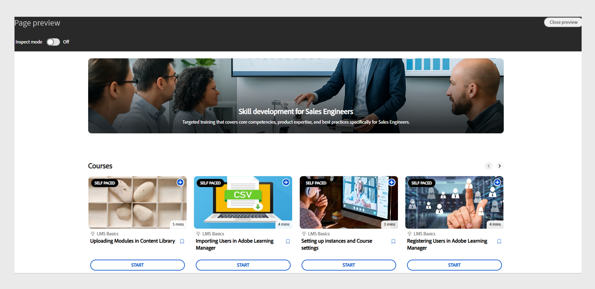

# Adobe Learning Manager 2025年10月版的新增功能

>[!IMPORTANT]
>
>请注意，概述的功能只是暂时的，可能会发生变化。 欲知更多详细信息和确认，请联系您指定的客户成功经理。 如果您遇到任何问题，请联系我们的客户支持团队：[learningmanagersupport@adobe.com](mailto:learningmanagersupport@adobe.com)

## 版本概述

Adobe Learning Manager 2025年10月版引入了多项重大改进，旨在提高报告准确性、扩展集成功能并增强管理员、作者和学习者的学习体验。 主要改进包括增强了“学习者成绩单” ，可准确捕获讲师标记的完成情况；扩展了“用户报告”并添加了标识字段；工作辅助报告并提供了直接下载链接。

此版本还引入了自定义管理员的限定公告权限、社交学习板中的用户标记功能，以及基于语言的进度跟踪，在不同的区域设置中保留学习者进度。 其他功能包括通过AI辅助创建播放列表而增强的Go1集成、通过增量导入支持而增强的自定义角色管理，以及改进的API，从而更好地跟踪测验性能和监视迁移状态。

## “学习者成绩单”中由讲师标记的完成数

**概述**

现在，即使会话日期之后已记录出席情况，增量学习者成绩单也会捕获由讲师标记的完成情况。
此增强功能解决了增量学习者成绩单中的一个关键差距，即如果在原始会话日期之后记录出勤情况，那么讲师标记的完成内容之前会被错过。

增量学习者成绩单是计划报告，仅捕获在指定期间内发生的更改（如完成或进度更新），而不是提供完整的历史数据转储。 它们常用于自动化、信息板和集成，允许用户高效地跟踪最近的学习活动，而无需每次处理整个成绩单历史记录。

**新增功能**

* **标记完成日期（UTC时区）列**：新的时间戳列，可捕获讲师将会话或模块标记为完成时的确切日期和时间。
* **增强的完成源跟踪**：跟踪记录完成情况的特定讲师和模块（例如，“教室”）。

这些更改可确保会话日期之后标记的完成情况准确反映在增量学习者成绩单中。

**主要优点**

* 在增量报告中捕获所有完成情况，无论何时标记出勤情况。
* 为法规遵从性和报告提供清晰的审计追踪。
* 支持自动化和仪表板以符合监管要求。

**用例**

* 在教室授课中，讲师可以在实际授课后标记出勤情况。
* 自动化系统或信息板，依赖增量学习者成绩单实现合规性或报告功能。

### 包含新列的学习者成绩单

请参阅此[文章](/help/migrated/administrators/feature-summary/learner-transcripts.md)，了解如何下载学习者成绩单。

下载的“学习者成绩单”报告包含新列：“标记完成日期（UTC时区）”。


_学习者成绩单报告会以黄色显示一个新列，突出显示所有用户的各个完成日期_

## 增强型用户报告及扩展数据字段

**概述**

用户报告现在包含其他字段，以改进用户跟踪和组织映射。

**新增功能**

* 内部用户ID列：提供唯一的内部标识符，以便跨不同系统和API端点顺畅地跟踪用户。
* “经理电子邮件”列：包括用于组织层次结构跟踪的直接经理联系人信息。

**主要优点**

* 简化了用户识别，并消除了跨多个系统映射用户时出现的问题。
* 通过集成功能支持下游用户管理工作流程。
* 改进了组织映射，并更好地了解报告关系。
* 保持组织界限并防止意外交叉通信。

**重要注意事项**

* 如果自定义管理员的作用域发生更改，则受影响的公告会显示一个警告图标，并要求重置各个作用域。
* 当范围发生更改时，必须单独更新每个公告。
* “ Notification Announcement ”报告仅显示自定义管理员分配范围内的学习者。

### 包含新列的用户报告

请参阅此[文章](/help/migrated/administrators/feature-summary/reports.md#user-activity-dashboards)，了解如何下载用户报告。

下载的用户报告文件包含新列：“内部用户ID”和“经理电子邮件”。


_用户报告，重点介绍内部用户ID和经理电子邮件地址，以简化用户管理_

## 支持内部用户ID的FTP用户报告

**概述**

基于FTP的用户报告现在包括内部用户ID支持，为无头实现提供统一的数据导出和集成方法。

**新增功能**

* 用户报告现在可通过[自定义FTP](/help/migrated/integration-admin/feature-summary/connectors.md#custom-ftp)以及现有报告（游戏成绩单、学习者成绩单、培训报告）获取。
* “内部用户ID”列现在在所有导出方法（FTP、作业API和UI）中保持一致。

**主要优点**

* 通过单一来源提供所有必要报告，简化了数据管理。
* 通过确保跨报告期的统一用户标识提高数据一致性。
* 通过启用具有一致标识符的批量操作和分析工作流而提供自动化工作流支持。
从FTP文件夹下载的用户报告包含新列“内部用户ID”。

## 在学习者成绩单中包括暂停的用户

**概述**

公司现在可以在学习者成绩单中包含挂起用户（具有已禁用的外部配置文件的用户），从而确保全面的历史学习数据保留。

**新增功能**

* 可配置的挂起用户可见性，带有帐户级别标志，可在学习者成绩单中包含挂起用户。
* 即使在停用挂起的外部配置文件后，仍会保留历史数据。

**实现要求**

* 请联系您的客户成功经理(CSM)以启用帐户级别标志。

>[!NOTE]
>
>默认情况下，现有帐户禁用此标志，对于新帐户，必须明确请求使用此标志。

## 自定义管理员的限定范围的公告权限

**概述**

自定义管理员现在可以创建公告，但只能为其分配的用户组或目录创建公告。 这可以防止跨组织边界的意外通信。

**新增功能**

* 自定义管理员只能为其分配范围内的用户创建公告。
* 公告的范围可以限定为特定的用户组或目录。
* 完全管理员可维护对所有公告的可见性和控制，包括由规定范围的自定义管理员创建的公告。

**主要优点**

* 有针对性的沟通，确保公告仅面向相关受众。
* 通过防止不相关的通知到达意外用户来减少信息过载。
* 保持组织界限并防止意外交叉通信。

**重要注意事项**

* 如果自定义管理员的作用域发生更改，则受影响的公告会显示一个警告图标，并要求重置各个作用域。
* 当范围发生更改时，必须单独更新每个公告。
* “ Notification Announcement ”报告仅显示自定义管理员分配范围内的学习者。

**用例**

* 特许经营组织，其中区域管理人员只需要与其特许经营人沟通。
* 具有区域或部门管理员的大型组织将发布目标定位到其团队。

### 为分配的范围创建公告

自定义管理员可创建仅限于其分配的用户组和目录的公告，确保消息送达正确的受众，并防止不必要的通知。

要为分配的范围创建公告，请执行以下操作：

1. 以管理员身份登录Adobe Learning Manager。
2. 在左侧导航窗格中选择&#x200B;**[!UICONTROL 公告]**。
3. 选择&#x200B;**[!UICONTROL 添加]**。

   
   _Adobe Learning Manager中的公告页面，管理员可以在其中为目标用户组创建和管理公告_

4. 从下拉菜单中选择&#x200B;**[!UICONTROL 公告类型]**。
a. **[!UICONTROL 作为通知]**
b. **[!UICONTROL 作为刊头]**
c. **[!UICONTROL 作为建议]**
d. **[!UICONTROL 作为电子邮件]**
5. 选择&#x200B;**[!UICONTROL 作为刊头]**。
6. 选择语言并上传刊头的图像。
7. （可选）添加操作按钮的URL。

   
   _创建公告屏幕，允许管理员设置公告类型、上传附件和添加操作按钮_

   分配的作用域已在&#x200B;**[!UICONTROL 作用域]**&#x200B;部分中预先选定，管理员无法对其进行修改。

   >[!NOTE]
   >
   >对于&#x200B;**[!UICONTROL 通知]**&#x200B;和&#x200B;**[!UICONTROL 电子邮件]**&#x200B;公告，如果它们与其分配的范围重叠，则它们可包括其他用户组和目录。

8. 选择&#x200B;**[!UICONTROL “保存”]**。

只有自定义管理员范围内的学习者才能查看公告。 请参阅此[文章](/help/migrated/administrators/feature-summary/announcements.md)，了解如何创建多种类型的公告。

## 在社交讨论区中为用户添加标签

**概述**

社交学习讨论区现在支持用户标记功能，能够实现更有针对性的讨论并改善学习社区内的协作。 可以通过学习者应用程序、API和Adobe Learning Manager参考站点，在社交学习帖子和评论中为学习者添加标签。

**新增功能**

* **@username标记**：用户可以使用“@username”格式标记其他讨论区成员。
* **范围受限标记**：只能标记有权访问特定讨论区的用户，从而确保隐私和相关性。
* **多渠道通知**：标记的用户会收到应用程序内通知和电子邮件通知，其中包含指向相关帖子或评论的直接链接。

**主要功能**

* 无法标记讨论区范围之外的用户，从而防止出现不需要的通知。
* 如果从系统中删除了已标记用户，其提及内容将显示为“匿名”。
* 不允许标记用户组或“@all”来防止通知垃圾邮件。

**用例**

* 寻求特定同事对医疗案件提供投入的医疗保健专业人员。
* 就专门专题咨询专题专家。
* 需要特定利益相关者投入的团队讨论。
* 知识共享会议，有针对性专家参与。

### 为社交讨论区帖子中的用户添加标签

学习者现在可以使用@username为帖子或评论中的特定讨论区成员添加标签。 标记仅限于有权访问该讨论区的会员。

要为社交讨论区中的用户添加标签，请执行以下操作：

1. 以学习者身份登录Adobe Learning Manager。
2. 在左侧导览窗格中选择&#x200B;**[!UICONTROL 社交学习]**。

   
   _选择“社交学习”以访问讨论区、共享见解并标记参与互动的用户，从而启用协作学习_

3. 选择&#x200B;**[!UICONTROL 新建帖子]**。

   
   _在社交学习中选择新帖子以开始新讨论，从而与带标记的用户分享知识_

4. 在为用户添加标签之前，请从&#x200B;**[!UICONTROL 将此内容发布到讨论区]**&#x200B;选项中选择讨论区。

   
   _选择一个讨论区以发布和标记用户，从而在社交学习中实现有针对性的协作对话_

5. 键入您的帖子详细信息，然后通过输入@符号后跟用户的名称(例如，@andrew)为用户添加标签。 在输入@后跟用户名的前三个字母时，它显示匹配用户的列表。

   
   _通过在用户名后键入@为讨论帖子中的用户添加标签，以在社交学习讨论区中启用目标协作_

6. 从列表中选择所需的用户。
7. 选择&#x200B;**[!UICONTROL 帖子]**。

已标记的用户会收到应用程序内通知和带有帖子直接链接的电子邮件通知，使讨论更具针对性和协作性。

### 根据讨论区范围标记用户

范围限制标记允许用户仅标记有权访问特定讨论区的学习者。 这有助于防止标记范围之外的用户，从而维护隐私。

如果尝试为讨论区范围之外的学习者添加标签，则不会显示任何建议，并且您将无法为其添加标签。 请参阅此[文章](/help/migrated/administrators/feature-summary/social-learning-configurations-as-an-admin.md)，详细了解社交学习范围。

## 在注释中标记已删除的用户

如果在社交学习帖子中标记了已删除的用户，则他们的姓名将在帖子中显示为“匿名” 。 评论和标记对于上下文仍然可见，但不会显示个人资料链接或详细信息。


_社交学习帖子，突出显示已删除的用户在标记时如何显示为匿名用户_

## 包含直接访问链接的工作辅助报告

**概述**

工作辅助报告已得到增强，包含指向工作辅助的直接下载链接，从而简化了管理员和作者的内容管理和审核流程。

**新增功能**

* 工作辅助链接列：从报告中直接访问工作辅助文件和外部URL。
* 基于角色的访问控制：链接辅助功能取决于用户角色和目录权限。
* 已删除的工作辅助仍可访问已激活的课程。

**主要优点**

* 从报告中直接下载文件和URL访问。
* 无需手动查找和下载工作辅助以进行法规遵从性或辅助功能审核。

**用例**

* 作者或管理员会根据大型组织的要求，对工作辅助进行定期无障碍审核。
* 任何需要快速、基于角色访问工作辅助文件的情景，以供审核或合规。

### 包含新列的工作辅助报告

查看此[文章](/help/migrated/administrators/feature-summary/reports.md#job-aids-report)，了解如何下载工作辅助报告。

可以从“报告”部分下载工作辅助报告，该报告现在包含每个工作辅助的直接下载链接。


_工作辅助报告显示直接下载链接，可以轻松访问和下载Adobe Learning Manager中的工作辅助_

## API更新

### 针对测验性能跟踪的学习者API增强

**概述**

`GET /loResourceGrades` API已得到增强，可提供详细的测验性能数据，从而支持更复杂的分析和自动化决策。

**新增功能**

API响应现在包括两个附加字段：

* **[!UICONTROL 最高分数]**：学习者在所有测试尝试中获得的最佳分数
* **[!UICONTROL maxScore]**：测验可能的总分数

**API响应示例**

```
{
    "links": {
        "self": "https://learningmanagerstage1.adobe.com/primeapi/v2/loResourceGrades/course:15067_30122_41715_1_3400468"
    },
    "data": {
        "id": "course:15067_30122_41715_1_3400468",
        "type": "learningObjectResourceGrade",
        "attributes": {
            "completed": false,
            "duration": 0,
            "hasPassed": false,
            "highestScore": 0,
            "maxScore": 0,. 
            "progressPercent": 0,
            "score": 0
        },
        "relationships": {
            "loResource": {
                "data": {
                    "id": "course:15067_30122_41715_1",
                    "type": "learningObjectResource"
                }
            }
        }
    }
}
```

作为响应，**课程:15067_30122_41715_1_3400468**&#x200B;是要为其请求信息的学习对象资源级别的ID。 可从`learningObjectResourceGrad` API获取`GET /enrollments/{id}`e ID。

**主要优点**

* 启用详细的测验性能分析，以衡量学习效果。
* 支持基于最高成就而不是最近尝试的进展规则。
* 提供一段时间内学习者测验性能的完整图片。

**API的工作方式**

1. 用户尝试测试多次；每次尝试都会进行录制。
2. 该API会提供测试的最高分数和可能的最高分数。
3. 外部系统可使用此数据来触发自动操作，例如根据用户的最佳表现将其注册到新课程中。

**用例**

* 无头学习系统需要自动作出注册决定。
* 学习分析平台跟踪学习者成就模式。
* 符合性系统要求基于性能的改进要求。

### 迁移API增强功能

**概述**
Adobe Learning Manager现在支持通过迁移过程将各种数据对象迁移至帐户。 此过程可通过API和用户界面启动。 迁移失败时，可以通过界面下载错误。 这些错误在调试迁移错误和管理迁移运行时非常有用。

在此版本中，您还可以通过API下载错误日志，以便高效地、以编程方式跟踪和调试错误。

**API更改**

新的迁移API `runStatus`允许集成管理员检查通过API触发的迁移运行状态，这在以前版本的Adobe Learning Manager中是不可能实现的。

此外，`runStatus` API现在提供了一个直接链接，可用于下载已完成运行的错误日志(CSV)。 请注意，该链接的有效期仅为七天，并且日志会保留一个月。

`startRun` API的响应已更新，包含了迁移项目ID、Sprint ID和Sprint运行ID，这些都是查询新状态终结点所必需的。

#### runStatus API

**描述**

检索现有迁移运行的状态。

**端点**

```
GET /bulkimport/runStatus
```

**参数**

* **migrationProjectId**： （必需）。 迁移项目的唯一标识符。 迁移项目用于将数据和内容从现有学习管理系统(LMS)传输到Adobe Learning Manager。 每个迁移项目可以由多个Sprint组成，它们是较小的迁移任务单元。

* **sprintId**： （必需）。 迁移项目中Sprint的唯一标识符。 Sprint是迁移任务的子集，其中包括要从现有LMS迁移到Adobe Learning Manager的特定学习项目（如课程、模块、学习者记录）。 每个Sprint都可以独立执行，从而允许分阶段迁移。

* **sprintRunId**： （必需）。 一个唯一标识符，用于跟踪迁移项目中特定Sprint的执行情况。 它与Sprint中定义的项目的实际迁移过程相关联。 sprintRunId有助于监视、故障排除和管理迁移作业。

**响应**

```
{
  "sprintId": 2510080,
  "sprintRunId": 2740845,
  "migrationProjectId": 2509173,
  "startTime": 1746524711052,
  "endTime": 1746524711052,
  [
    {
      "id": 2609923,
      "lastHeartbeatTime": 1746524711052,
      "objectName": "content",
      "jobState": "COMPLETED",
      "errorCsvLink": "",
      "errorLogLink": "migration/5830/2509173/2510080/2740845/content_err.csv",
      "sequenceNumber": 1
    },
    {
      "id": 2609922,
      "lastHeartbeatTime": 1746524713577,
      "objectName": "course",
      "jobState": "WAITING_IN_QUEUE",
      "errorCsvLink": "",
      "errorLogLink": null,
      "sequenceNumber": 2
    }
  ]
}
```

#### startRun API

`startRun` API响应已更新为包括三个附加字段 — migrationProjectId、sprintId和sprintRunId。 这些字段允许用户使用新的runStatus API跟踪和查询特定迁移运行的状态。

```
curl -X GET --header 'Accept: text/html' 'https://learningmanager.adobe.com/primeapi/v2/bulkimport/runStatus?migrationProjectId=001&sprintId=10001&sprintRunId=7'
```

生成以下响应。 响应包含：

* migrationId
* sprintId
* sprintRunId

**响应**

```
{
  "status": "OK",
  "title": "BULKIMPORT_RUN_INITIATED_SUCCESSFULLY",
  "source": {
    "info": "Success",
    "migrationInfo": {
      "migrationProjectId": "001",
      "sprintId": "10001",
      "sprintRunId": "7"
    }
  }
}
```

### 社交API更改（用户标记、评论和回复）

**概述**

Adobe Learning Manager现在支持@user社交学习讨论区中的标签功能，学习者可以在帖子、评论和回复中提及和通知同行。 此功能增强了跨平台的协作和内容发现。

此版本引入了新的API功能以支持用户提及，包括增强的POST和GET端点，并且为标记用户引入了新的搜索功能。

**API更改概述**

* 更新了POSTAPI，用于创建包含用户提及的帖子/评论/回复
* 更新了响应中包含GET提及数据的API

**用户提及的格式**

使用以下格式提及用户： @(user:userId)

#### 创建提及帖子

**端点**

```
POST /primeapi/v2/posts
```

**描述**

创建包含用户提及的新社交学习帖子。

**请求正文**

```
{
  "data": {
    "type": "post",
    "attributes": {
      "boardId": 13282,
      "accountId": 11152,
      "text": "<p>This is a new post mentioning @[user:11257229]</p>",
      "createdByUserId": 11257228,
      "postType": "discussion"
    },
    "id": null
  }
}
```

**响应**

_userMentions_&#x200B;关系中包含提及数据的标准帖子创建响应。

#### 创建包含提及的评论

**端点**

```
POST /primeapi/v2/comments
```

**描述**

在有用户提及的帖子中添加评论。

**请求正文**

```
{
  "data": {
    "type": "comment",
    "attributes": {
      "postId": 20746,
      "accountId": 11152,
      "text": "<p>Test Comment @[user:11257229]</p>",
      "createdByUserId": 11257228,
      "commentLevel": 0
    },
    "id": null
  }
}
```

#### 创建包含提及的回复

**端点**

```
POST /primeapi/v2/replies
```

**描述**

回复包含用户提及的评论。

**请求正文**

```
{
  "data": {
    "type": "reply",
    "attributes": {
      "postId": 20746,
      "accountId": 11152,
      "text": "<p>Thanks for the update @[user:11257229]</p>",
      "createdByUserId": 11257228,
      "commentLevel": 1,
      "parentCommentId": 55621
    },
    "id": null
  }
}
```

#### 检索包含提及的帖子

**端点**

```
GET /primeapi/v2/posts/{id}
```

**描述**

检索帖子详细信息，包括提及的用户。

**响应**

```
{
  "links": {
    "self": "https://learningmanager.adobe.com/primeapi/v2/posts/7522"
  },
  "data": {
    "id": "7522",
    "type": "post",
    "attributes": {
      "commentCount": 3,
      "dateCreated": "2025-06-10T11:33:29.000Z",
      "dateUpdated": "2025-06-25T14:52:04.000Z",
      "downVote": 0,
      "postingType": "DEFAULT",
      "richText": "<p>my updated fourth post @[user:14707776] second mention my first post</p>",
      "state": "ACTIVE",
      "text": "my updated fourth post @[user:14707776] second mention my first post",
      "upVote": 0,
      "viewsCount": 0
    },
    "relationships": {
      "createdBy": {
        "data": {
          "id": "14707776",
          "type": "user"
        }
      },
      "parent": {
        "data": {
          "id": "3971",
          "type": "board"
        }
      },
      "userMentions": {
        "data": [
          {
            "id": "14707776",
            "type": "user"
          }
        ]
      }
    }
  },
  "included": [
    {
      "id": "14707776",
      "type": "user",
      "attributes": {
        "avatarUrl": "https://cpcontents.adobe.com/public/images/default_user_avatar.svg",
        "binUserId": "45664b87-75a3-43ec-b0b7-5064958eac6f",
        "email": "user@example.com",
        "enrollOnClick": false,
        "fields": {
          "Location": "BLR"
        },
        "gamificationEnabled": true,
        "lastLoginDate": "2025-06-27T11:21:17.000Z",
        "name": "John Doe",
        "pointsEarned": 1690,
        "pointsRedeemed": 0,
        "preferredResolution": "AUTO",
        "profile": "admin",
        "roles": [
          "Learner",
          "Admin",
          "Author",
          "Instructor",
          "Integration Admin",
          "Manager"
        ],
        "state": "ACTIVE",
        "userType": "Internal"
      },
      "relationships": {
        "account": {
          "data": {
            "id": "9238",
            "type": "account"
          }
        }
      }
    }
  ]
}
```

### 社交API更改（用户搜索）

**端点**

```
GET /primeapi/v2/users/search?q={searchTerm}&context=tagging
```

**描述**

根据社交范围设置搜索可用于添加标签的用户。

**请求参数**


* q（必填）：搜索词（最少3个字符）。
* 上下文：设置为“标记”以使用户有资格被提及。
* 讨论区ID（可选）：根据访问权限筛选用户的讨论区ID。

**响应**

```
{
  "data": [
    {
      "id": "11257229",
      "type": "user",
      "attributes": {
        "name": "Jane Smith",
        "email": "jane.smith@example.com",
        "avatarUrl": "https://cpcontents.adobe.com/public/images/default_user_avatar.svg",
        "userType": "Internal",
        "state": "ACTIVE"
      }
    }
  ]
}
```

### 实施指南

#### 字符限制

* 帖子：4000个字符适用，每个带标记的用户将可用字符减少固定数量。
* 注释：最多1000个字符。

#### 提及验证

* 用户只能通过用户名或电子邮件标记（而不能通过UUID标记）。
* 内部用户无法标记外部用户，反之亦然。
* 标记可用性遵循现有的社交范围设置。
* 讨论区权限决定标记资格（公共/私有）。

#### 通知

* 在一个帖子中多次提及同一用户会导致一次通知。
* 原始帖子所有者仅在添加了特别标记时收到通知。

#### 错误处理

* 提及中的无效用户ID返回验证错误。
* GDPR和软删除的用户在标记的内容中显示为匿名。

### 基于语言的学习者进度

目前，系统仅会跟踪选定区域设置语言的学习者进度，从而在播放器中切换语言/区域设置时，导致进度明显丢失。 此限制会导致用户体验不佳，学习者在探索不同语言的内容时失去学习进度。

**当前问题**

* **进度覆盖**：在用户和模块级别跟踪播放器中每个模块的进度。 这会导致在用户切换回同一模块之前使用的区域设置时，其进度被覆盖。
* **进度重置**：例如，如果学习者在区域设置A（英语）中实现了75%的进度，然后切换到区域设置B（西班牙语），则在返回区域设置A后，其进度重置为0%，而不是从75%恢复。

要解决这些限制，增强了API以支持特定于区域设置的进度跟踪：

* **特定于区域设置的存储**：学习者在播放器内切换区域设置（例如，从区域设置A切换为区域设置B）时，系统现在会分别保存内容的每个区域设置的进度状态。
* **进度恢复**：当用户切换回以前使用的区域设置（从区域设置B切换回区域设置A）时，内容会从该特定区域设置中用户停止的位置恢复。
* **独立的进度跟踪**：每个区域设置均保持其自身的进度状态，允许学习者探索多种语言的内容，而不会丢失每种语言的单个进度。

#### API 更改

以下API已得到增强，以支持新的locale参数：

* GET播放器状态API
* POST播放器状态API

#### GET播放器状态API

**端点**

```
GET /primeapi/v2/users/{userId}/playerState
```

**描述**

检索特定用户和区域设置的学习对象的当前状态。

**参数**

| 参数 | 类型 | 位置 | 必填 | 描述 |
|---|---|---|---|---|
| 用户ID | 字符串 | 路径 | 是 | 用户的唯一标识符 |
| loId | 字符串 | 查询 | 是 | 学习对象标识符格式为lo：{id} |
| loResourceId | 字符串 | 查询 | 是 | 课程格式的学习对象资源标识符： {loId_loInstanceId_moduleId_moduleVersion} |
| csrf_token | 字符串 | 查询 | 是 | CSRF保护令牌 |
| 区域设置 | 字符串 | 查询 | 可选 | 语言特定进度的区域设置标识符（例如，“en-US”、“es-ES”） |

**示例请求**

```
GET /primeapi/v2/users/12345/playerState?loId=lo:67890&loResourceId=course:67890_1_mod123_v2&csrf_token=abc123&locale=en-US
```

**响应行为**

* 如果提供了locale参数且存在特定于区域设置的状态，则API会返回该区域设置的进度。
* 如果提供了locale参数，但不存在特定于区域设置的状态，则API会针对默认状态执行回退搜索。
* 如果忽略locale参数，则API会返回默认状态（保持向后兼容性）。
* 对于语言环境为空的无头请求，API将回退到默认状态查找。

#### POST播放器状态API

**端点**

POST/primeapi/v2/users/{userId}/playerState

**描述**

为特定用户和区域设置更新或创建学习对象的当前状态。

**参数**

| 参数 | 类型 | 位置 | 必填 | 描述 |
|---|---|---|---|---|
| 用户ID | 字符串 | 路径 | 是 | 用户的唯一标识符 |
| loId | 字符串 | 查询 | 是 | 学习对象标识符格式为lo：{id} |
| loResourceId | 字符串 | 查询 | 是 | 课程格式的学习对象资源标识符： {loId_loInstanceId_moduleId_moduleVersion} |
| csrf_token | 字符串 | 查询 | 是 | CSRF保护令牌 |
| 区域设置 | 字符串 | 查询 | 可选 | 语言sp的区域设置标识符 |

**请求正文**

请求正文包含区域设置特定的学习对象状态数据。

**示例请求**

```
POST /primeapi/v2/users/12345/playerState?loId=lo:67890&loResourceId=course:67890_1_mod123_v2&csrf_token=abc123&locale=en-US
```

```
{
  "progress": 75,
  "completionStatus": "incomplete",
  "timeSpent": 1800,
  "lastAccessedPage": 5,
  // Additional state data
}
```

该API会创建或更新指定区域设置的学习对象状态。

## Go1集成增强功能

**概述**

增强了Go1集成，以支持播放列表管理、学习路径创建和定期认证工作流程，同时过渡到预览并购买内容模型。

**新增功能**

* 使用AI聊天帮助或手动选择直接在Go1中创建和管理播放列表。
* 轻松将Go1播放列表转换为Adobe Learning Manager学习路径。
* 使用自动进度重置功能在循环认证周期中加入Go1课程。
* 升级的内容发现界面改进了浏览和内容监管。
* 从免费内容到透明成本模型的过渡。

**主要优点**

* AI辅助的播放列表创建可显着加快内容分组和交付。
* 允许使用Go1内容满足经常性的法规培训要求。
* 清晰的预览和购买模型支持明智的内容投资决策。
* 改进了发现和监管工具，以更好地进行内容管理。

**重要说明**

* 所有Go1功能都需要有效的Go1许可证。
* 先前的免费Go1内容将停用。 组织必须预览和购买所需的内容捆绑包。
* 管理员和作者可以创建和管理播放列表；学习者保持仅查看访问权限。

**用例**

* 需要大量外部内容库来执行全面培训计划的组织。
* 注重合规性的培训计划，需要定期更新内容并安排交付周期。
* 学习团队正在寻求通过AI帮助减少内容监管开销。

### 创建Go1播放列表

管理员可以根据位置、角色、产品和其他条件，使用为不同学习者组定制的Go1课程创建播放列表。 可以手动创建播放列表，也可以使用AI生成播放列表。

要创建播放列表，请执行以下操作：

1. 以管理员身份登录Adobe Learning Manager。
2. 在左侧导览窗格中选择&#x200B;**[!UICONTROL 内容市场]**。

   
   _选择Adobe Learning Manager中的“内容市场”，探索热门的Go1课程并将其添加到播放列表中_

3. 选择&#x200B;**[!UICONTROL 内容中心]**，然后选择&#x200B;**[!UICONTROL 库]**。
4. 选择&#x200B;**[!UICONTROL 创建播放列表]**并从以下选项中选择：
a. **[!UICONTROL 使用AI]**：借助AI创建播放列表。
b. **[!UICONTROL 我自己]**：手动向播放列表添加课程来创建播放列表。

   
   _选择“创建播放列表”以在Adobe Learning Manager中创建新播放列表，从而组织和提供面向学习者的目标课程_

**使用AI创建播放列表**

管理员可以在AI提示中键入播放列表说明。 AI将监管相关课程，并根据要求创建播放列表。

要使用AI创建播放列表，请执行以下操作：

1. 选择&#x200B;**[!UICONTROL 创建播放列表]**，然后选择&#x200B;**[!UICONTROL 使用AI]**。

   
   _使用AI创建精选播放列表，以便根据学习者的需求自动推荐课程_

2. 在&#x200B;**[!UICONTROL 输入学习目标]**&#x200B;文本字段中键入有关播放列表的简短说明。
3. 选择&#x200B;**[!UICONTROL 下一步]**。

   
   _键入您的学习目标以创建自定义播放列表，以帮助Adobe Learning Manager推荐适合您学习者需求的目标课程_

4. 从列表中选择技能，然后选择播放列表的课程持续时间和类型。
5. 选择&#x200B;**[!UICONTROL 生成播放列表]**。

   
   _通过选择相关技能和课程持续时间在Adobe Learning Manager中自定义您的播放列表_


此时会创建包含10门课程的播放列表，管理员可以使用播放列表创建学习路径。


_查看Adobe Learning Manager中精选的销售工程师技能增强播放列表_

**手动创建播放列表**

手动选择最符合学习者要求的课程，并策划其他相关课程。

手动创建播放列表：

1. 选择&#x200B;**[!UICONTROL 创建播放列表]**，然后选择&#x200B;**[!UICONTROL 我自己]**。

   
   _手动创建播放列表，让管理员能够根据特定的学习者需求完全控制课程的授课方式_

2. 键入播放列表的标题和说明。

   
   _在Adobe Learning Manager中为播放列表添加标题和描述，以清楚地定义其用途并帮助学习者进行有针对性的技能开发_

3. 选择&#x200B;**[!UICONTROL 创建]**。
4. 选择&#x200B;**[!UICONTROL 添加项]**&#x200B;以添加相关课程。

   
   _在Adobe Learning Manager中将项目添加到销售工程师技能开发播放列表中以策划目标课程_

5. 搜索并选择所需课程。

播放列表包含相关课程，管理员可以使用列表创建学习路径。

### 将Go1播放列表添加到学习路径

管理员可以创建包含Go1播放列表的学习路径，以便学习者可以在培训过程中访问选定的第三方课程。

要创建学习路径，请执行以下操作：

1. 以管理员身份登录Adobe Learning Manager。
2. 在左侧导览窗格中选择&#x200B;**[!UICONTROL 学习路径]**。
3. 选择&#x200B;**[!UICONTROL 添加]**。

   
   _在“学习路径”部分选择“添加”，为学习者创建和组织新的结构化培训方案_

4. 键入所需的详细信息，然后选择&#x200B;**[!UICONTROL 保存]**。 有关详细信息，请参阅此[文章](/help/migrated/administrators/feature-summary/learning-paths.md)。
5. 选择&#x200B;**[!UICONTROL 添加Go1课程]**。

   
   _将Go1课程添加到您的销售工程师技能开发播放列表中，以使用精选的第三方内容扩展学习选项_

6. 在&#x200B;**[!UICONTROL 库]**&#x200B;中，在“选择&#x200B;**[!UICONTROL Go1课程”屏幕]**&#x200B;上搜索并选择播放列表。

   >[!NOTE]
   >
   >确保已设置“由我创建”过滤器，以便轻松找到播放列表。

   
   _从Adobe Learning Manager的Go1课程库中选择销售工程师播放列表_

7. 选择&#x200B;**[!UICONTROL 添加到库]**，然后选择&#x200B;**[!UICONTROL 保存]**。

   
   _从Adobe Learning Manager的Go1库中选择并导入Sales Engineer Skills Enhancement播放列表_

8. 选择&#x200B;**[!UICONTROL 添加]**，然后选择&#x200B;**[!UICONTROL Publish]**。

播放列表中的课程将添加到“学习路径”中。 管理员随后可以注册学习者，以便立即开始课程。

## 保存语言的播放器状态进度

**概述**

流体播放器现在可为模块中的每种语言单独保存进度。 这意味着您可以在语言之间切换，并在每种语言中从上次中断的地方继续，而不会丢失您的进度并重新开始。

**主要优点**

* 在语言之间跳转并从每种语言中的确切位置恢复。
* 非常适合在学习过程中需要访问多种语言内容的学习者。
* 以任意语言完成模块，同时以您访问的所有语言保持进度。

**用例**

* 员工说多种语言的全球组织，可能需要以母语和英语参考内容。
* 合规性培训，学习者可能使用一种语言开始，但出于认证目的需要使用另一种语言完成。
* 技术培训计划，学习者可以更好地理解其母语的概念，但需要英语术语才能完成工作。

**重要说明**

* 流体播放器的语言首选项会保留在会话中。 如果学习者更改语言并转到其他模块，则只要播放器保持打开，新语言就会用于后续模块。
* 级别（完成状态）仍将在模块级别进行跟踪，而不是按区域设置进行跟踪。 满足完成标准的第一个区域设置将更新模块的级别。 如果学习者使用一种语言完成模块，然后切换到另一种语言，则任何更进一步的分级更新都将被上一级别的更新覆盖，但每个区域设置的进度仍会被保留。

## 增量用户导入中的自定义角色导入支持

Adobe Learning Manager现在支持在现有多增量用户导入工作流程（常规完整用户导入+启用增量功能的工作流程）中导入自定义角色。 此增强功能允许以增量方式上传和处理role.csv和user_role.csv文件，而无需每次完全上传数据。

以前，role.csv和user_role.csv文件只能以完整模式上传，这意味着管理员必须在每次上传时包含所有以前添加的角色定义和分配。 有了这一新的增量支持，只需要上传新的或修改后的角色数据，从而减少了管理开销并提高了效率。

**新增功能**

1. 对自定义角色和角色分配的增量支持：

   * role.csv和user_role.csv现在可在多文件增量工作流程中增量处理。
   * 无需每次导入时都上传所有现有角色和用户角色数据。

2. 增强的多增量工作流实施：

   * 在FTP中为每个上传的用户导入文件创建单独的文件夹。
   * 每个文件夹包含：

      * 用户导入文件 — (File1.csv)
      * 相应的角色和角色分配文件 — (File1_role.csv、File1_user_role.csv)

   例如，user1.csv对应于user1_role.csv（自定义角色）和user1_user_roles.csv（用户 — 角色映射）。

   **处理前的FTP结构示例：**

   ```
   import/user/internal/  
        File1.csv  
        File2.csv  
       File3.csv  
   
   UserRole/  
       File1_role.csv  
       File1_user_role.csv  
       File2_role.csv  
       File2_user_role.csv  
       File3_role.csv  
       File3_user_role.csv  
   ```

3. Adobe Learning Manager还支持多达20个增量用户CSV及其相应的自定义角色CSV，使其适用于大规模操作。

**用例**

* 全球公司通过为每个区域（欧盟、美洲、亚洲）上传多个增量用户文件来管理区域团队，从而允许管理员在单个工作流程中更新用户并为每个区域分配新角色。
* 大型企业通过定期从HR系统获取增量用户更新来自动完成入门培训和权限。 这支持无缝更新用户配置文件和精细的角色分配，无需手动干预。

## 在Salesforce应用程序中重置推荐

**概述**

以前，使用Adobe Learning Manager Salesforce应用程序的学习者只能选择角色和推荐首选项一次。 如果他们更改了角色，则需要访问本机Adobe Learning Manager应用程序以更新其配置文件并接收相关课程建议。 这带来了学习体验，也有助于降低Salesforce环境中的参与度。

**新增功能**

Adobe Learning Manager现在在Salesforce应用程序中提供&#x200B;**[!UICONTROL 重置兴趣]**&#x200B;按钮。 学习者现在可以重置其角色和学习首选项，而无需离开Salesforce或登录本机Adobe Learning Manager应用程序。 此增强功能可简化对个性化学习内容的访问，从而确保推荐内容随着用户角色的变化而保持相关性。

**用例**

* 更改工作角色、团队或责任的学习者可以快速重置首选项，以接收更新且相关的课程推荐，且所有这些操作都可以在Salesforce应用程序中完成。
* 通过删除切换到原生Adobe Learning Manager应用程序的需求，学习旅程更顺畅，从而鼓励通过Salesforce持续参与和消费推荐的内容。
* 管理员可以从更高的学习完成率和用户角色与推荐内容之间更好的协调中获益，无需对交换平台提供额外支持或指导。

### 重置Salesforce应用中的兴趣

要从Salesforce应用程序中重置兴趣和建议，请执行以下操作：

1. 以学习者身份登录适用于Salesforce的Adobe Learning Manager应用程序。
2. 选择底部的&#x200B;**[!UICONTROL 重置兴趣]**&#x200B;选项。

学习者的推荐或兴趣将从Adobe Learning Manager Salesforce应用程序中重置。

## 使用Experience Builder创建学习门户

>[!IMPORTANT]
>
>我们很高兴宣布，Experience Builder是用于创建可自定义学习门户的创新工具，将在Adobe Learning Manager 2025年10月版后推出。
>
>随着发布日期的临近，敬请关注更多更新。 我们期待看到您如何使用Experience Builder转变学习门户。
>
>如有任何问题或其他信息，请联系您的客户成功经理。

**简介**

Experience Builder是Adobe Learning Manager中的一种无代码/低代码工具，可帮助您创建自定义学习门户。 它允许您设计品牌化、用户友好的学习门户，而无需具备技术技能或丰富的编码知识。
使用Experience Builder，您可以创建新页面、菜单和小组件，以快速轻松地为受众提供个性化学习体验。 使用Experience Builder，您可以快速创建新页面、菜单和小组件，以为受众提供个性化的学习体验。

**问题陈述**

使用Experience Builder之前，企业面临以下挑战：

1. **有限自定义**：门户网站修复了设计，几乎没有选项可用于反映您的品牌。 管理员只能进行基本更改，例如修改页眉、页脚或颜色，这限制了您创建独特体验的能力。
2. **成本**：构建自定义门户网站需要花费大量的开发人员和较长的时间，通常需要6至9个月才能完成。 这一做法增加了总体拥有成本和延迟部署。
3. **一般体验**：每个人都看到相同的内容，即使这与他们的角色或需求无关。 个性化的缺乏降低了学习者的参与度和满意度。
4. **技术障碍**：非技术管理员难以创建或更新门户，因为他们需要编码知识或外部支持。

Experience Builder通过提供用于创建个性化、品牌化门户的简单、无代码/低代码解决方案解决了这些问题。

它使管理员能够设计满足其组织需求的门户，而无需依靠技术专业知识或外部开发人员。

**主要优点**

**轻松自定义**

* 通过自定义页眉、页脚、徽标和布局设计符合您品牌的门户。
* 使用小组件添加课程、类别和HTML元素等动态内容。
* 创建适合特定受众的页面和菜单，确保学习者看到相关内容。

**无代码/低代码解决方案**

* 管理员无需编写代码即可创建和管理门户，非技术性用户可访问门户。
* 拖放功能简化了构建页面和菜单的过程。

**个性化学习**

* 配置页面和菜单以显示与特定用户组（如销售团队、设计人员或工程师）相关的内容。
* 使用隐藏页面可提供仅通过直接链接访问的独家内容。

**全球覆盖**

* 创建多语言页面以支持世界各地的学习者。
* 对内容进行本地化以迎合不同受众并提高可访问性。

**移动友好**

* 学习者可以在任何设备（包括手机和平板电脑）上访问内容。
* 在桌面视图和移动视图中预览页面以确保流畅的体验。

**真实使用案例**

**品牌门户**

* 创建一个与公司网站外观相似的学习门户，并在其中加入徽标、颜色和布局。
* 例如，医疗保健公司可以设计一个与公司品牌相匹配的门户，同时集成学习内容。

**基于角色的学习**

* 为工程师、销售团队或设计人员等特定角色构建页面。
* 例如，销售团队可能会看到产品培训，而工程师则会访问技术课程。

**产品培训**

* 为不同的产品(例如Photoshop、Illustrator或其他产品/服务)设置单独的页面。
* 每个页面都可以包含显示与产品相关的课程、认证和资源的小组件。

**员工和客户培训**

* 通过门户加入新员工、培训外部合作伙伴或向客户介绍您的产品。
* 例如，软件公司可以为客户教程和故障排除指南创建一个门户。

**本地化内容**

* 为全球学习者提供多种语言的内容。
* 例如，跨国公司可以创建英语、西班牙语和法语页面，以适应其多样化的员工。

### Experience Builder的构造块

Experience Builder的主要组件和构建块经过精心设计，以提供灵活性、易用性和针对性的学习体验。 详细分类如下：

#### 页面

页面是在Experience Builder中构建学习门户的基础。 管理员可以针对特定受众或目的创建新页面。 此外，管理员还可以：

* 创建具有灵活布局（行和列）的自定义页面。
* 添加小组件以使用内容填充页面。
* 管理具有草稿和已发布状态的页面生命周期。
* 从菜单中隐藏页面，同时通过直接链接使其可访问。

例如，销售培训页面可能包含显示相关课程、口碑和近期会话日程表的小组件。

#### 菜单

菜单将页面组织为学习者可导航的结构。 管理员可以：

* 创建自定义菜单以将特定用户组的页面分组。
* 添加层次结构和排序，以优先查看特定受众。
* 包括用于分组相关页面的子菜单。

例如，名为Resources的菜单可能包含用于eBooks、视频和常见问题解答的页面。

#### 小组件

小组件允许管理员向页面添加动态内容和功能。 下列小组件可用：

* 日历
* 类别
* 合规状态
* 课程和路径
* 内容框
* 游戏
* HTML
* Iframe
* 我的学习
* 社交学习

例如，页面可能包含一个“课程和路径”小组件，用于显示推荐的课程，以及一个日历小组件，用于后续的培训课程。

#### 品牌工具

Experience Builder提供了用于自定义门户外观的工具。 管理员可以：

* 自定义页眉、页脚和布局以匹配公司品牌。
* 使用CSS和JavaScript设置高级样式。

例如，医疗保健公司可以使用品牌工具创建与其公司网站的外观相匹配的门户。

### Experience Builder快速入门

一家软件公司希望为其客户建立一个培训门户。 门户将包含各种产品(例如Photoshop和Illustrator)的页面，并以菜单形式排列。 其中包括可显示课程、认证和近期培训会话的小组件。

#### 创建页面

要在Adobe Learning Manager中创建页面，请执行以下操作：

1. 以管理员身份登录Adobe Learning Manager。
2. 在左侧导航窗格中选择&#x200B;**[!UICONTROL 品牌推广]**。
3. 选择&#x200B;**[!UICONTROL 自定义页面]**。
4. 选择&#x200B;**[!UICONTROL 创建页面]**。

   
   _显示“创建页面”选项的“自定义页面”屏幕，用于设计新的自定义学习体验_

5. 键入&#x200B;**[!UICONTROL 页面名称]**(例如，Photoshop培训)。
6. 键入&#x200B;**[!UICONTROL 页面说明]**(例如，了解如何有效使用Photoshop)。
7. 从以下选项中选择页面类型：

   * **[!UICONTROL 使用ALM小组件生成]**：管理员可以使用现有的Adobe Learning Manager小组件创建页面。
   * **[!UICONTROL 外部页面]**：管理员可以为外部页面添加URL。 如果选择页面类型为外部，请在“页面URL”文本字段中添加URL。

8. 选择&#x200B;**[!UICONTROL 更改图标]**&#x200B;以更改页面图标。

   
   _课程页面创建屏幕，显示用于键入自定义学习者页面的页面名称、说明、类型和图标的选项_
9. 选择&#x200B;**[!UICONTROL 添加新语言]**&#x200B;以添加页面的默认语言。
10. 选择&#x200B;**[!UICONTROL “保存”]**。

已创建页面，并将其保存为“自定义页面”部分中的草稿。 管理员可以使用小组件编辑和设计草稿页面。

按照相同的步骤为Illustrator等其他产品创建页面。

#### Experience Builder中的“设计”页面

Adobe Learning Manager使管理员能够使用可自定义的小组件设计符合其要求的页面。
要在Experience Builder中设计页面，请执行以下操作：

1. 以管理员身份登录Adobe Learning Manager。
2. 在左侧导航窗格中选择&#x200B;**[!UICONTROL 品牌推广]**。
3. 选择“**[!UICONTROL 自定义页面]**”，然后选择所需的页面。
4. 选择&#x200B;**[!UICONTROL 页面设计]**。
5. 选择&#x200B;**[!UICONTROL “编辑”]**。

   
   _编辑模式允许管理员组织章节并以首选语言添加小组件，从而设计课程页面_

6. 从&#x200B;**[!UICONTROL 选择分区布局]**&#x200B;下拉菜单中选择选项。
7. 根据要在该部分中添加的小组件的数量和大小，从以下部分选择一个部分：

   * **[!UICONTROL 1列 — 全部分宽]**：内容跨越整个部分宽度以实现最大空间。
   * **[!UICONTROL 2列–1/2节宽各]**：两个等宽列均匀分割节。
   * **[!UICONTROL 2列，节宽分别为2/3和1/3]**：主内容占三分之二，边内容占三分之一。
   * **[!UICONTROL 2列，节宽分别为1/3和2/3]**：侧边内容占三分之一，主要内容占三分之二。
   * **[!UICONTROL 3列–1/3节宽度，每列]**：三个等宽列将节分成三分之二。

   
   _分区布局选择对话框允许管理员为自定义页面设计选择单列或多列Widget排列_

8. 选择&#x200B;**[!UICONTROL “继续”]**。
9. 选择&#x200B;**[!UICONTROL 添加小组件]**。

   
   _页面设计屏幕允许管理员选择和添加小组件以自定义其课程页面_

10. 选择所需的小组件，然后选择&#x200B;**[!UICONTROL 继续]**。
11. 配置小组件并选择&#x200B;**[!UICONTROL 添加小组件]**。 有关添加和配置小组件的信息，请参阅此[部分](#add-and-configure-widgets)。
12. 选择“**[!UICONTROL 保存]**”，然后从以下选项中进行选择：

   * **[!UICONTROL 另存为草稿]**：页面将保存为草稿。 管理员稍后可以编辑该页面。
   * **[!UICONTROL 保存并Publish]**：页面将发布，管理员可以将此页面添加到菜单中。


_保存选项允许管理员选择将页面保存为草稿以供将来编辑还是发布以供学习者访问_

页面可以保存为草稿或已发布。 管理员可以在发布之前编辑草稿，还可以更新和重新发布已发布的页面。

#### 添加和配置小组件

**日历小组件**

该小组件以日历格式直观地展示课程和时间表。 它支持按目录、注册状态、位置、产品和角色进行筛选。 响应式设计适合各种网格大小。

要配置日历小组件，请执行以下操作：

1. 从Experience Builder的[设计页面](#design-page-in-experience-builder)中执行步骤1-9。
2. 选择&#x200B;**[!UICONTROL 日历]**，然后选择&#x200B;**[!UICONTROL 继续]**。

   
   _突出显示日历小组件选项的小组件选择屏幕，用于在日历中显示培训会话_

3. 键入&#x200B;**[!UICONTROL 小组件标题]**&#x200B;和&#x200B;**[!UICONTROL 小组件描述]**。

   
   _日历小组件自定义屏幕，管理员可以在其中设置小组件的标题、描述并选择目录_

4. 通过搜索选择目录，以在&#x200B;**[!UICONTROL 日历]**&#x200B;小组件中显示其课程和学习路径。
5. 选择&#x200B;**[!UICONTROL 添加小组件]**。

日历小组件将添加到页面中。 管理员可以添加其他小组件并发布页面。

**类别小组件**

此小组件将类别（如角色、目录）显示为拼贴，从而生成过滤视图或特定页面。

要配置类别小组件，请执行以下操作：

1. 从Experience Builder的[设计页面](#design-page-in-experience-builder)中执行步骤1-9。
2. 选择&#x200B;**[!UICONTROL 类别]**，然后选择&#x200B;**[!UICONTROL 继续]**。

   
   _小组件选择屏幕，突出显示“类别”小组件选项，可按目录、产品或角色组织学习内容，以便轻松导航_

3. 选择要在类别卡上显示的详细信息：

   * **[!UICONTROL 类别图像]**
   * **[!UICONTROL 类别描述]**

4. 键入&#x200B;**[!UICONTROL 小组件标题]**&#x200B;和&#x200B;**[!UICONTROL 小组件描述]**。
5. 搜索并从&#x200B;**[!UICONTROL 类别源]**&#x200B;中选择目录。

   
   _配置类别小组件选项以设置小组件标题和描述，并选择类别源_

6. 选择&#x200B;**[!UICONTROL 添加小组件]**。

类别小组件将被添加到页面。 管理员可以添加其他小组件并发布页面。

**合规性小组件**

此小组件支持按日历过滤，但侧重于与合规性相关的学习对象。 它允许学习者动态修改或删除合规性标签过滤器。

要配置合规性构件，请执行以下操作：

1. 从Experience Builder的[设计页面](#design-page-in-experience-builder)中执行步骤1-9。
2. 选择&#x200B;**[!UICONTROL 合规性状态]**，然后选择&#x200B;**[!UICONTROL 继续]**。

   
   _小组件选择屏幕，突出显示“合规性状态”小组件，用于显示具有截止日期和状态指示器的学习者注册_

3. 键入&#x200B;**[!UICONTROL 小组件标题]**&#x200B;和&#x200B;**[!UICONTROL 小组件描述]**。

   
   _合规性状态小组件屏幕，管理员可以在该屏幕中设置小组件标题和描述，以显示学习者的注册截止日期和状态_

4. 选择&#x200B;**[!UICONTROL 添加小组件]**。

合规性状态小组件将添加到页面。 管理员可以添加其他小组件并发布页面。

**课程和路径小组件**

此小组件显示课程或路径磁贴的条带，可自定义以显示不同的详细信息。

要配置“课程和路径”小组件，请执行以下操作：

1. 从Experience Builder的[设计页面](#design-page-in-experience-builder)中执行步骤1-9。
2. 选择&#x200B;**[!UICONTROL 课程和路径]**。

   
   _小组件选择屏幕，突出显示“课程和路径”小组件，用于将课程、学习路径、认证和工作辅助显示为学习者的交互式卡片_

3. 选择&#x200B;**[!UICONTROL “继续”]**。
4. 键入&#x200B;**[!UICONTROL 小组件标题]**&#x200B;和&#x200B;**[!UICONTROL 小组件描述]**。
5. 选择目录或手动选择最多25个要显示的课程。

   
   _课程和路径小组件，管理员可在其中设置小件的标题、说明，并选择要以交互式卡形式显示的课程或学习路径_

6. 选择&#x200B;**[!UICONTROL 添加小组件]**。

“课程和路径”小组件将添加到页面中。 管理员可以添加其他小组件并发布页面。

**内容框构件**

此小组件允许创建包含标题、描述、图像和CTA的节。

要配置Content Box小组件，请执行以下操作：

1. 从Experience Builder的[设计页面](#design-page-in-experience-builder)中执行步骤1-9。
2. 选择&#x200B;**[!UICONTROL 内容框]**，然后选择&#x200B;**[!UICONTROL 继续]**。

   
   _小组件选择屏幕，突出显示“内容框”小组件，用于显示自定义图像、文本和操作按钮，以增强学习者参与度_

3. 键入&#x200B;**[!UICONTROL 标题]**&#x200B;和&#x200B;**[!UICONTROL 描述]**。
4. 将文本键入到&#x200B;**[!UICONTROL 动作按钮标签]**&#x200B;中，并提供链接。
5. 选择背景填充的任何选项：

   * **[!UICONTROL 颜色]**：从拾色器中选择颜色或在文本字段中键入颜色代码。
   * **[!UICONTROL 图像]**：浏览并上传图片。

6. 使用&#x200B;**[!UICONTROL 内容框高度]**&#x200B;选项调整框高度。
7. 选择文本格式选项。

   
   _内容框小组件自定义屏幕，管理员可以在其中输入标题、描述、操作按钮标签和链接_

8. 选择&#x200B;**[!UICONTROL 添加小组件]**。

内容框小组件将添加到页面。 管理员可以添加其他小组件并发布页面。

**游戏构件**

此小组件以排行榜格式显示学习者的游戏和点数。 该版本已针对Experience Builder进行了更新，包含名称、描述和本地化自定义。

要配置游戏小部件，请执行以下操作：

1. 从Experience Builder的[设计页面](#design-page-in-experience-builder)中执行步骤1-9。
2. 选择&#x200B;**[!UICONTROL 游戏]**，然后选择&#x200B;**[!UICONTROL 继续]**。

   
   _小组件选择屏幕，突出显示了用于显示排行榜上的学习活动和成就的游戏小组件_

3. 键入&#x200B;**[!UICONTROL 小组件标题]**&#x200B;和&#x200B;**[!UICONTROL 小组件描述]**。
4. 选择&#x200B;**[!UICONTROL 添加小组件]**。

此时会将游戏小组件添加到页面。 管理员可以添加其他小组件并发布页面。

**HTML小组件**

此小组件允许嵌入自定义HTML、CSS和JS代码，为推荐等静态内容提供了灵活性。

要配置HTML小组件，请执行以下操作：

1. 从Experience Builder的[设计页面](#design-page-in-experience-builder)中执行步骤1-9。
2. 选择&#x200B;**[!UICONTROL HTML]**，然后选择&#x200B;**[!UICONTROL 继续]**。

   
   _小组件选择屏幕，突出显示使用HTML、CSS和JavaScript代码自定义页面的HTML小组件_

3. 在相应字段中键入您的&#x200B;**[!UICONTROL HTML]**、**[!UICONTROL CSS]**&#x200B;和&#x200B;**[!UICONTROL JavaScript]**&#x200B;代码。
4. 选择&#x200B;**[!UICONTROL 添加小组件]**。

HTML小组件将添加到页面。 管理员可以添加其他小组件并发布页面。

**IFrame小组件**

此小组件允许直接在页面内嵌入外部Web应用程序或网页。 包含命名、描述和本地化iframe内容的选项。

要配置Iframe小组件，请执行以下操作：

1. 从Experience Builder的[设计页面](#design-page-in-experience-builder)中执行步骤1-9。
2. 选择&#x200B;**[!UICONTROL Iframe]**，然后选择&#x200B;**[!UICONTROL 继续]**。

   
   _构件选择屏幕，突出显示Iframe构件，用于在所选部分内嵌入外部应用程序或网页_

3. 在&#x200B;**[!UICONTROL 链接到动作按钮的页面]**&#x200B;选项中键入URL。
4. 使用&#x200B;**[!UICONTROL Iframe height]**&#x200B;选项调整Iframe高度。

   
   _Iframe构件自定义屏幕，管理员可以在其中输入页面URL并指定iframe高度以嵌入外部内容_

5. 选择&#x200B;**[!UICONTROL 添加小组件]**。

Iframe小组件将添加到页面中。 管理员可以添加其他小组件并发布页面。

**我的学习小组件**

此小组件与“课程和路径”小组件类似，但会专门针对每个学习者过滤内容，显示其已注册的学习对象个性化集。

要配置“我的学习”小部件，请执行以下操作：

1. 从Experience Builder的[设计页面](#design-page-in-experience-builder)中执行步骤1-9。
2. 选择&#x200B;**[!UICONTROL 我的学习]**，然后选择&#x200B;**[!UICONTROL 继续]**。

   
   _小组件选择屏幕，突出显示“我的学习”小组件，用于显示学习者已注册课程的个性化列表_

3. 键入&#x200B;**[!UICONTROL 小组件标题]**&#x200B;和&#x200B;**[!UICONTROL 小组件描述]**。
4. 选择&#x200B;**[!UICONTROL 添加小组件]**。

此时页面会添加“我的学习”小部件。 管理员可以添加其他小组件并发布页面。

**社交学习Widget**

此小组件支持社交协作功能，例如平台中的帖子、评论和用户标记。 它通过自定义选项（包括名称和本地化）增强了Experience Builder。

要配置社交学习小部件，请执行以下操作：

1. 从Experience Builder的[设计页面](#design-page-in-experience-builder)中执行步骤1-9。
2. 选择&#x200B;**[!UICONTROL 社交学习]**，然后选择&#x200B;**[!UICONTROL 继续]**。

   
   _小组件选择屏幕，突出显示“社交学习”小组件，用于显示帖子以鼓励协作和参与_

3. 键入&#x200B;**[!UICONTROL 小组件标题]**&#x200B;和&#x200B;**[!UICONTROL 小组件描述]**。
4. 选择&#x200B;**[!UICONTROL 添加小组件]**。

此时社交学习小组件将添加到页面。 管理员可以添加其他小组件并发布页面。

#### 将页面组织到菜单中

菜单可帮助组织和链接Experience Builder中的页面，使学习者可以轻松地在学习门户中导航。 管理员可以创建菜单、向其中添加页面以及自定义向特定受众显示哪些菜单。

**创建菜单**

要创建菜单，请执行以下操作：

1. 以管理员身份登录Adobe Learning Manager。
2. 在左侧导航窗格中选择&#x200B;**[!UICONTROL 品牌推广]**。
3. 选择&#x200B;**[!UICONTROL 菜单]**，然后选择&#x200B;**[!UICONTROL 创建]**。

   
   _菜单屏幕显示了用于查看、组织和创建不同学习者组的自定义菜单的选项_

4. 键入&#x200B;**[!UICONTROL 菜单名称]**（例如，产品培训），然后在&#x200B;**[!UICONTROL 可见]**&#x200B;选项中选择用户组。

   
   _创建菜单屏幕，管理员可以在其中输入菜单名称以供内部使用，并指定用户组以控制菜单可见性_

5. 从&#x200B;**[!UICONTROL 选择页面]**&#x200B;选项中选择自定义页面。

   
   _页面选择屏幕，突出显示包含用户组的自定义页面并自定义菜单顺序的选项_

6. 选择“**[!UICONTROL 预览菜单]**”以在保存菜单之前查看它。
7. 选择&#x200B;**[!UICONTROL “保存”]**。

选定学习者将可看到“已创建”菜单。 他们可以通过其学习者UI访问自定义页面。


_学习者UI显示包含特色培训模块的自定义页面，可从侧边栏菜单轻松导航_

#### 管理页面生命周期

管理员可以使用“自定义页面”部分来编辑、删除和复制页面。

**编辑页面**

要编辑自定义页面，请执行以下操作：

1. 以管理员身份登录Adobe Learning Manager。
2. 在左侧导航窗格中选择&#x200B;**[!UICONTROL 品牌推广]**。
3. 选择&#x200B;**[!UICONTROL 自定义页面]**。
4. 选择所需页面，然后选择&#x200B;**[!UICONTROL 编辑]**。
5. 选择&#x200B;**[!UICONTROL “保存”]**。

页面将根据更改进行更新。


_编辑自定义页面，允许管理员更新页面名称、描述和类型_

**删除页面**

要删除页面，请执行以下操作：

1. 以管理员身份登录Adobe Learning Manager。
2. 在左侧导航窗格中选择&#x200B;**[!UICONTROL 品牌推广]**。
3. 选择&#x200B;**[!UICONTROL 自定义页面]**。
4. 选择所需的页面。
5. 选择&#x200B;**[!UICONTROL 操作]**，然后选择&#x200B;**[!UICONTROL 删除]**。


_自定义页面屏幕显示用于删除为产品培训创建的自定义页面的选项_

**复制页面**

要复制页面，请执行以下操作：

1. 以管理员身份登录Adobe Learning Manager。
2. 在左侧导航窗格中选择&#x200B;**[!UICONTROL 品牌推广]**。
3. 选择&#x200B;**[!UICONTROL 自定义页面]**。
4. 选择所需的页面。
5. 选择&#x200B;**[!UICONTROL 操作]**，然后选择&#x200B;**[!UICONTROL 复制]**。


_自定义页面屏幕显示用于复制为产品培训创建的自定义页面的选项_

#### 预览页面

要预览页面，请执行以下操作：

1. 以管理员身份登录Adobe Learning Manager。
2. 在左侧导航窗格中选择&#x200B;**[!UICONTROL 品牌推广]**。
3. 选择&#x200B;**[!UICONTROL 自定义页面]**。
4. 选择所需页面，然后选择&#x200B;**[!UICONTROL 页面设计]**
5. 选择&#x200B;**[!UICONTROL 编辑]**，然后选择&#x200B;**[!UICONTROL 预览页面]**&#x200B;以查看门户的预览。


_页面预览，显示带有横幅的自定义页面布局和特色课程_

#### 本地化页面

当管理员向自定义页面添加多种语言时，请在默认语言选项卡旁的相应语言选项卡中，添加每种语言的小组件详细信息。


_管理员除了添加默认语言之外，还可以添加其他语言（例如法语）的小组件详细信息_

#### 设置隐藏页面

隐藏页面选项可让管理员通过显示更少的页面来保持学习者UI干净。 管理员可以在菜单中隐藏页面，这样学习者便不会在学习者用户界面中看到这些页面，但学习者仍然可以通过其他方式访问这些页面。 例如，“目录”页面可以在菜单中隐藏，但可通过其他导航路径访问。


_菜单配置屏幕，显示目录、社交学习、技能和徽章等隐藏页面_


<!-- We're excited to share several important updates coming to Adobe Learning Manager with the upcoming releases. These enhancements aim to streamline admin workflows, improve data reporting accuracy, and strengthen role-based controls.

These changes are designed to reduce manual effort, support automation, and improve governance across training operations.

## Capture instructor-marked completions in Learner Transcript

### Audience  

Administrator and automation owners 

### Overview 

In Adobe Learning Manager, when using incremental Learner Transcripts (LT) for automation workflows, instructor-marked completions made after the session date are not captured. The completion timestamp reflects the original session end time (not the time the instructor marked the completion). Since these updates fall outside the one-day change window used for incremental LT generation, as a result, learners' attendance and completion data are excluded from reports, leading to inaccurate or incomplete downstream reporting and potential compliance gaps. 

### What has changed 

Learner Transcript (LT) reports include completions marked by instructors after the session date. This ensures that any delayed attendance marking is correctly reflected in the transcript export. 

Attendance states like "Attended with pass/fail" will appear automatically in incremental LT exports. 

### What's new 

* New column: Mark Completed Date (UTC TimeZone). 
* Completion Source is available at module level. 
* Compatible with connector-based or job API-generated LT reports. 


**Action required**

* If your automation depends on column positions, ensure logic accounts for the new column. 
* If using column names, no changes are required. 
* Retrofitted completions (manual imports) are not included. 

## Download links in Job Aids report

### Audience 

Administrator, custom administrator, and automation owners 

### Overview 

The Job Aids report includes a direct download link for each job aid, allowing quick access from the report itself. 

### What's new  

A new column, **[!UICONTROL Job Aid Link]**, has been added to the third position in the report. It links directly to the job aid if it's a file or shows the external URL provided by the author. 

Users with access (admin/authors and custom roles) can download the job aid using this link. 

 

### Action required 

* Review automated workflows using Job Aids reports (using Jobs API). 
* If the script is based on column position, update scripts accordingly. 
* No action is needed if using column names. 

## Internal User ID and Manager Email columns added to User Report

### Audience 

Administrators (and custom administrators) using the **[!UICONTROL User Report]** (**[!UICONTROL Admin]** > **[!UICONTROL Users]** > **[!UICONTROL Internal]** > **[!UICONTROL Export User data]**) downloaded from the administrator User Interface. 

### Overview 

To assist in user identification and integration workflows, two columns, **[!UICONTROL Internal User ID]** and **[!UICONTROL Manager Email]** have been added to the User report, exported via the User Interface. 

### What's new 

The User report includes a user's internal user ID and their manager's email address, to map them uniquely across different tools or API endpoints. 

### Action required 

* If using this report in automated flows, then this newly added column should be taken care of in automation.  
* No changes are needed if workflows are not impacted. 

## Scoped announcement permissions for custom administrators

### Audience 

Custom administrators 

### Overview 

Custom administrators can create announcements only for the user groups or catalogs within their defined scope. 

### What's new 

* Scoping rules allow custom administrators to create announcements for specific user groups or catalogs only. 
* When defining a custom role, administrators can assign announcement permissions with scope on user groups or catalogs. 
* Custom administrators are limited to creating announcements within their given scope. 
* The notification announcement report for custom administrators will display learners only within their assigned scope. 

### Action required 

* The format of the report will remain unchanged. If custom administrators download it from the User Interface, the content of the report will be subject to their scope. 
* No modifications are necessary if this report is not utilized in any automated or downstream workflow.

See the [Release notes](https://experienceleague.adobe.com/en/docs/learning-manager/using/introduction/release-notes) article for a cumulative list of new features and changes to Adobe Learning Manager.-->
