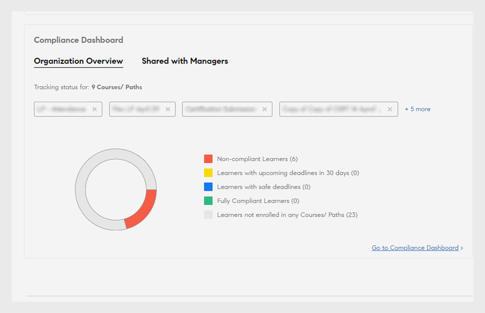
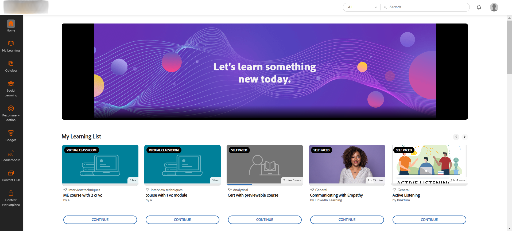

# 2024年7月新增功能摘要 {#new-features-summary-july-2024}

了解Adobe Learning Manager 2024年7月版的新增功能和增强功能。

>[!NOTE]
>
>观看此[网络研讨会](https://nam04.safelinks.protection.outlook.com/?url=https%3A%2F%2Flearningmanager.adobe.com%2Fapp%2Flearner%3FaccountId%3D98632%23%2Fcourse%2F10078152&amp;data=05%7C02%7Cchandrum%40adobe.com%7C90e588d31b994e6a5f4e08dcb87f26a8%7Cfa7b1b5a7b34438794aed2c178decee1%7C0%7C0%7C638588103494535076%7CUnknown%7CTWFpbGZsb3d8eyJWIjoiMC4wLjAwMDAiLCJQIjoiV2luMzIiLCJBTiI6Ik1haWwiLCJXVCI6Mn0%3D%7C0%7C%7C%7C&amp;sdata=dNyxQl3IQjEtfGCMnhlfek4Piz%2BPGFfuUss53M8mFK8%3D&amp;reserved=0)，了解有关此版本中新增功能的更多信息。

## 合规性信息板中的增强功能

### 什么是合规性信息板？ {#whatiscompliancedashboard}

**Adobe Learning Manager**&#x200B;中的&#x200B;**[!UICONTROL 合规性信息板]**&#x200B;允许经理监控和监控学习者实现其学习目标的进度。 他们可检查团队成员是否在截止日期前完成任务并及时完成学习过程，这有助于确保遵循相关说明。 管理员可以设置合规性信息板并与经理共享。

要在管理员应用程序中访问合规性信息板，请选择&#x200B;**[!UICONTROL 报告]** > **[!UICONTROL 学习摘要]** > **[!UICONTROL 合规性信息板]**。

### 此版本中改进的功能

使用增强的合规性信息板，管理员和经理可以查看与其特定类别（例如，销售、营销和法律部门）相关的合规性类型的课程、学习路径或认证。 管理员可以将自定义合规性课程分类为特定类别。 自定义合规性类别由目录标签提供支持。  管理员可以创建课程信息板并与经理共享。 然后，经理可以在各自的实例上查看同一信息板。 合规性信息板和合规性电子邮件通知的用户界面也得到了增强。


#### 工作流

以下是使用增强的合规性信息板的步骤：

| 角色 | 任务 | 其他信息 |
|---|---|---|
| 管理员 | 创建自定义合规性标签 | 有关详细信息，请参阅此文章[创建自定义合规性标签](/help/migrated/administrators/feature-summary/reports.md#compliance-dashboard) |
| 作者 | 将这些标签添加到课程中 | 有关更多信息，请参阅本文[向课程/学习路径/认证添加合规性标签](/help/migrated/authors/feature-summary/courses.md#add-compliance-labels-to-courselearning-pathcertification)。 |
| 管理员 | 创建包含合规性课程的信息板并与经理共享 | 有关详细信息，请参阅这篇文章[创建并共享合规性仪表板](/help/migrated/administrators/feature-summary/reports.md#create-and-share-a-compliance-dashboard)。 |
| 经理 | 查看合规性信息板 | 有关详细信息，请参阅此文章[合规性状态](/help/migrated/managers/feature-summary/manager-dashboard.md#compliance-status) |

## 学习者用户界面改进

>[!IMPORTANT]
>
>新学习者UI将分阶段发布。

**学习者UI**&#x200B;更新为更加优雅和现代的设计。 **[!UICONTROL 学习者主页]**、**[!UICONTROL 我的学习]**、**[!UICONTROL 目录]**&#x200B;和&#x200B;**[!UICONTROL 课程概述]**&#x200B;登陆页面正在呈现全新的现代化外观。 课程卡还采用新设计，以现代方式显示详细信息。 将鼠标悬停在课程卡上，即可显示课程说明和发布日期。

>[!NOTE]
>
>改版后的用户界面仅适用于沉浸式布局。 移动Web或应用程序尚不支持这些更改，将在未来版本中更新。


_旧用户界面_


_新用户界面_

### 此版本中改进的功能

**使外观和感觉现代化**

全新的视觉元素符合现代设计趋势，使产品看起来直观且吸引人。 这包括新的刊头、侧面板和外观现代的构件。

**增强的用户体验**

学习者现在可以在以下页面查看类似的卡片视图：“主页” 、 “目录”、“我的学习”和“课程概述”页面，从而提供统一的体验。

查看[学习者主页](/help/migrated/learners/feature-summary/learner-home-page.md)了解更多信息。

**课程发布日期的更改**

借助此增强功能，导入到Adobe Learning Manager中的LinkedIn和Go1课程的发布日期将成为LinkedIn和Go1上的实际发布日期。 您还可以在用户界面上查看LinkedIn和Go1课程的实际发布日期。 有关详细信息，请查看[课程卡](/help/migrated/learners/feature-summary/learner-home-page.md#course-cards)。

## 未登录体验的更新

利用未登录体验，您可以为未登录客户创建实时体验。 这是其营销活动的登陆页面，可提供足够的信息来鼓励注册。

### 此版本中改进的功能

客户可以购买高级计划来构建这种高度可扩展的非登录体验。 此未记录的体验由[培训数据访问](/help/migrated/integration-admin/feature-summary/connectors.md#training-data-access)提供支持，可使用Adobe Learning Manager API提供有关名额限制、已占用名额、轮候表限制和轮候表计数的实时数据。 客户可以使用这些API提供未登录学习者搜索和筛选功能以及完整的课程摘要。 有关API的详细信息，请参阅这篇文章[未登录的API](/help/migrated/integration-admin/feature-summary/non-logged-in-apis.md)。

>[!NOTE]
>
>请联系支持团队或CSAM购买高级计划。

## 支持多个库存单位(SKU)

学习者现在可以将多个课程、学习路径或认证添加到购物车并一起购买。

### 此版本中改进的功能

以前，学习者一次只能购买一门课程。 在此版本的&#x200B;**Adobe Learning Manager**&#x200B;中，客户可以使用购物车一次购买多个课程、学习路径或认证。

仅学习者应用程序（现有UI、新学习者UI和移动沉浸式应用程序）中有此功能可用。

在ALM[&#128279;](/help/migrated/learners/feature-summary/multi-item-cart.md)中查看多项目购物车

## 流体播放器中的HTML5内容支持

**Adobe Learning Manager**&#x200B;现在支持将HTML5内容作为.zip文件上传到内容库。 上传后，这些文件可作为模块包含在课程中。 此外，作者还可以为自学HTML5模块定义完成标准，允许学习者标记完成模块或启动时自动完成模块。

### 此版本中改进的功能

Adobe Learning Manager现在支持在自学课程中添加HTML5支持的内容。 作者可以将HTML5内容作为.zip文件添加到自学内容。 学习者可以在流体播放器中查看HTML5内容。 通过此新功能，学习者现在可以直接在流体播放器中对自学课程标记为已完成。 有关详细信息，请查看[在内容库中添加HTML5文件类型](/help/migrated/authors/feature-summary/content-library.md#add-html5-file-type-in-the-content-library)。

借助新的增强功能，只要作者将完成条件设置为新选项&#x200B;**[!UICONTROL “启动内容时”]**，则访问URL时，具有外部链接的课程将自动标记为完成。 新选项&#x200B;**[!UICONTROL 完成标准]**&#x200B;已添加到“活动模块”页面中，作者可以在其中设置外部链接的完成标准。 有关详细信息，请查看[在HTML模块](/help/migrated/authors/feature-summary/courses.md#add-html-link-in-the-activity-module)中添加活动链接。


_完成条件选项 — 活动模块_

## 移动应用程序上的课程过期推送通知

学习者在错过课程截止日期时，将会收到推送通知。 通过此新增强功能，学习者现在可以选择将提醒暂停24小时，或者下周针对他们收到的每个逾期提醒获取提醒。 这仅适用于截止日期逾期通知。 查看[计划推送通知](/help/migrated/learners/feature-summary/user-notifications.md#schedule-the-push-notification)

## 此版本中的 API 更改

### 搜索API

Search API包含以下更改：

学习者可以使用```GET /search``` API在目录过滤器中搜索标签。 学习者可以通过选择```tag```作为```filter.loTypes```参数的值来搜索标签。

**卷曲示例**

```
curl -X GET --header 'Accept: application/vnd.api+json' --header 'Authorization: oauth <oauth_token>' 'https://example.com/primeapi/v2/search?page[limit]=10&query=Business&autoCompleteMode=true&filter.loTypes=tag&sort=relevance&filter.ignoreEnhancedLP=true&matchType=phrase&persistSearchHistory=true&stemmed=false&highlightResults=true'
```

新过滤器、可用名额、可用轮候表和时间范围过滤器已添加到以下API： ```GET /search```和`GET /learningObjects`。

新筛选器`filter.session.includeEnrollmentDeadline`已添加到以下API ```GET /search```。

### 帐户API

已在```GET /account``` API中添加了新列`custom_injections`、`showComplianceLabel`和`complianceLabelDefaultID`以获取用户终结点的帐户数据。

### 学习对象 API

以下为此次更新中对学习对象API所做的更改：

新响应的旧作者ID和`GET /learningObjects` API中的`authorDetails`下添加的其他详细信息。 此外，已添加新过滤器`filter.authors`，以过滤旧作者及其课程。

名为`effectivenessIndex`的新属性将帮助您获取课程效果数据。

**卷曲示例**

```
curl --location 'https://example.com/primeapi/v2/learningObjects/course%3A9790045?enforcedFields%5BlearningObject%5D=effectivenessData' \
--header 'Accept: application/vnd.api+json' \
--header 'Authorization: oauth <oauth_token>'
```

新响应`whoShouldTake`已添加到以下API： `POST /learningObjects/query`、`GET /learningObjects/{id}`和`GET /learningObjects`，其中提供了有关谁应该参加此课程的详细信息。

**卷曲示例**

```
curl -X GET --header 'Accept: application/vnd.api+json' --header 'Authorization: oauth <oauth_token>' 'https://example.com/primeapi/v2/learningObjects/course%3A1131255' 
```

新响应`waitlistLimit`已添加到`GET /learningObjects` API，其中提供了有关轮候表限制的详细信息。

提供学习对象总计数的新响应`count`已添加到API `GET/ learningObjects`和`POST/ learningObjects/query`。

已在`GET/ learningObjects` API中的`catalogLabels`下添加了新的响应`catalogFieldId`和`fieldValueId`。

学习者可以在API `GET /preview/learningObjects`中获取目录标签值。

### 用于获取市场计数的新API

在此版本中，添加了新API `GET /search/marketplace/count`。 这可以帮助您获取内容市场中可用学习对象的计数。

**卷曲示例**

```
curl -X GET --header 'Accept: application/vnd.api+json' --header 'Authorization: oauth <oauth_token>' 'https://example.com/primeapi/v2/search/marketplace/count?query=course'
```

**示例响应**

```
{
  "count": 54910
}
```

### 学习对象实例API

以下为此次更新中对学习对象实例API所做的更改：

在此版本中，名为`gamificationEnabled`的新密钥已添加到学习对象实例API `GET /learningObjects/{loId}/instances/{loInstanceId}`。

**卷曲示例**

```
curl --location 'http://example.com/acapapi/primeapi/v2/learningObjects/learningProgram:12756/instances/learningProgram:12756_15644' 
```

上述API的新`gamificationSettings`属性可获取游戏设置的详细信息。 例如： `GET /learningObjects/{loId}/instances/{loInstanceId}/gamificationSettings`。

**卷曲示例**

```
curl --location 'http://example.com/acapapi/primeapi/v2/learningObjects/learningProgram:103852/instances/learningProgram:103852_103526/gamificationSettings'
```

上述API的新`leaderboard`属性可获取游戏设置的详细信息。 例如： `GET /learningObjects/{loId}/instances/{loInstanceId}/leaderboard`。

**卷曲示例**

```
curl --location 'https://example.com/primeapi/v2/learningObjects/learningProgram:106339/instances/learningProgram:106339_105775/leaderboard' \
--header 'Accept: application/vnd.api+json' \
--header 'Authorization: oauth <oauth_token>'
```

### 日期和 — date的排序行为变更

支持按日期和日期排序的API会显示所有学习对象（学习路径除外）基于发布日期的结果。 学习路径仍会根据&#x200B;**有效修改时间**&#x200B;日期列出。 此更改将在以下API中显示：

* GET /learningObjects
* GET /search
* POST /learningObjects/query
* POST/搜索/查询

### 偏移限制的更改

为改进系统性能并更有效地管理资源利用率，Adobe在ADMIN和LEARNER范围的GET/users端点中弃用了高偏移值。 我们建议使用作业API检索具有偏移值的记录。

### RPM和突发限制的变化

在此版本中，为所有API添加了RPM（每分钟请求数）和突发限制。 您可以在Swagger页面上检查每个API的最大RPM。

RPM是您在一分钟内可以发送到API服务器的请求数。 突发限制允许在短时间内处理更多请求，超出通常的速率限制。

### 已弃用的API

有关产品中所有已弃用API的累积列表，请在Adobe Learning Manager[&#128279;](/help/migrated/api-deprecations-list.md)中查看API弃用。

## 对报告的更改

### 合规性信息板

在此版本中，合规性信息板报告包含两个新列：

* 状态
* 合规类型

这是对现有列的补充：

* 用户名
* 用户电子邮件
* 学习计划/认证/课程
* 类型
* 注册日期（UTC 时区）
* 截止日期（UTC 时区）
* 完成日期（UTC 时区）
* 进度百分比

### 培训报告

**管理员** > **报告** > **自定义报告**&#x200B;和&#x200B;**作业API**&#x200B;中的培训报告过去具有名为&#x200B;**技能**&#x200B;和&#x200B;**标记**&#x200B;的列。 这些列现已重命名为&#x200B;**技能**&#x200B;和&#x200B;**标签**。

### 内容审核报告

在此版本中，**[!UICONTROL 内容审查追踪]**&#x200B;报告现在在“修改类型”列中包括以下新属性：

* 用户组添加
* 用户组删除
* 添加自定义标签
* 自定义标签移除
* 添加共享目录
* 删除共享目录
* 共享目录更新

## 此更新中修复的错误

**活动提交**

* 在网络调用中，尝试将文件重新上传到活动提交模块失败，并显示错误500。

**API**

* 如果多名讲师具有相同的电子邮件地址，则创建Connect VC会议将会失败。
* 注册学习路径后，MS Teams VC的“概述”页面上显示错误的URL。
* 作为作业API响应的一部分提供的用户报告预签名的URL在六小时后过期。
* 在生成课程注册报告时， “课程名称”列显示的课程名称不正确。
* 迁移工作进程在为课程调用批量API时无法发送唯一的学习对象ID，但ID会被删除。
* 课程包含在用户可以访问的特定目录中后（默认目录处于禁用状态），即使设置阻止未注册的学习者查看课程，您仍然可以通过learningobject/id端点检索课程元数据。
* 当skillname在/learningObject APIGET中的名称中包含逗号时，技能过滤器无法按预期工作。
* SFTP数据保留工作程序中文件的时间戳元数据不一致。
* 如果删除并重新配置了任何连接器，则项目迁移状态似乎已关闭。
* 培训报告将“标记”作为列标题，而不是“标记”。
* 如果目录被禁用并且任何导出的课程仅是禁用目录的一部分，则Commerce连接器导出会失败。

**认证**

* 有时，重新注册用户以参加循环认证会失败。

**自定义角色**

* 在某些情况下，当自定义管理员尝试切换到讲师角色时，会显示“错误403 filible”（禁止使用）。

**电子邮件模板和通知**

* 取消会话后，当从会话中删除讲师时，电子邮件通知不会发送给最后一组讲师。
* 在创建虚拟讲师主导的培训后，组织者不会收到MS Teams的电子邮件通知。 只有在发布课程并启用电子邮件模板后，才会触发电子邮件。
* 有时，电子邮件模板包含不正确的日期格式和翻译。

**学习者**

* 当学习者注册了课程的多个实例，而您下载了出勤报告时，报告会包含错误信息。
* 如果将其他用户的私人帖子添加到公共文章中，则用户可以查看这些帖子。
* 在某些情况下，无法从认证中取消注册学习者。 尝试取消注册时，会显示错误消息。
* 仅选择一门课程后，即使管理员将认证标记为已完成，认证仍会被标记为已完成。
* 如果会话结束时间更改为之前的日期，则管理员无法将VC标记为完成。
* 对于轮候表中的学习者，“会话出席情况”报告显示为“未出席”。

**学习者应用程序**

* 将课程备注下载为PDF后，备注会随机显示。 他们不服从命令。

**学习路径**

* 在“学习路径”中选择技能后，选择该文本字段时，下拉列表未按预期显示。
* 在某些情况下，您无法从学习路径中删除技能。

**学习计划**

* 如果灵活学习计划包含许多课程，则在管理员标记完成学习计划后，该计划仍未完成。
* 学习者更改实例时，注册报告中的last_modified_by列不会更新。

**举报**

* 在某些情况下，管理员无法导出培训报告。
* 如果SCORM内容包含的问题或答案超过32,767个字符，则您无法在Excel中下载课程测验报告。
* 选择“重置游戏”后，“级别实现日期”不会重置。

**搜索**

* 目前，导出所有用户组后，删除的用户组也具有输出功能。
* 由于间歇性搜索问题，您无法搜索认证。

## 此版本中的已知问题

Mobile Offline播放器不会加载HTML5内容。

## 系统要求

查看[Adobe Learning Manager系统要求](/help/migrated/system-requirements.md)。

## Adobe Learning Manager 的早期版本

* [2024年3月版](/help/migrated/whats-new-march-2024.md)
* [2023年11月版](/help/migrated/whats-new-november-2023.md)
